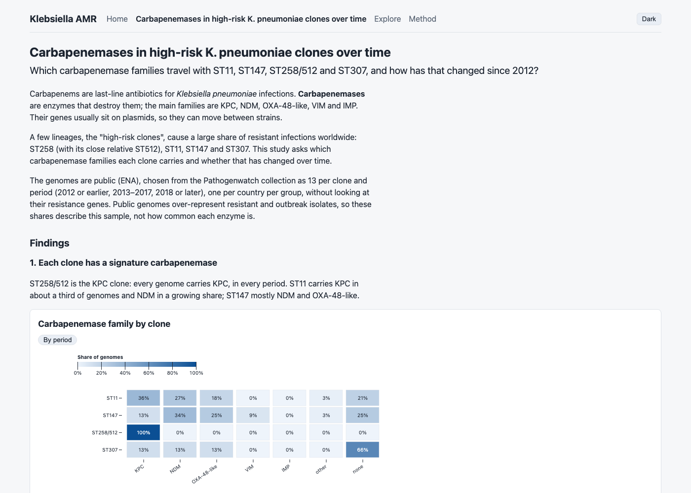
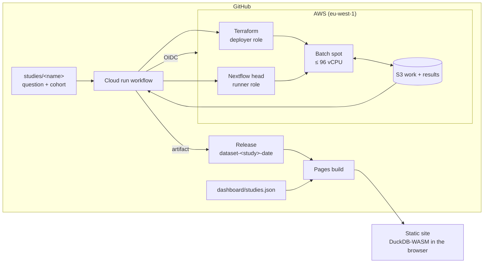

# AMR Cloud Pipeline

[](https://github.com/simomounir/amr-cloud-pipeline/actions/workflows/ci.yml)

Public *Klebsiella pneumoniae* genomes go through a Nextflow pipeline on AWS Batch spot
instances, come out as validated, versioned Parquet tables, and are shown as interactive
study pages that run entirely in the visitor's browser. The same pipeline runs on a laptop,
in CI and on AWS. Uses public data; results demonstrate a method, not new surveillance findings.

**Live site:** https://simomounir.github.io/amr-cloud-pipeline/



Numbers as of study 1 ([carbapenemase clones](studies/carbapenemase-clones/RESULTS.md)):

| Genomes analysed | Cost per analysed genome | Agreement with Pathogenwatch |
|---|---|---|
| 152 of 156 selected (4 failed assembly) | $0.031 ($4.76 for the run) | 99% on sequence type, 99% on carbapenemase family |

## Architecture



Long-lived pieces (state bucket, results bucket, IAM roles, OIDC provider) stay up and cost
pennies. Compute (VPC, Batch, queue) is created for a run and destroyed after it. Details:
[infra/README.md](infra/README.md).

### What happens when you click Cloud run

1. **Actions -> Cloud run** takes a study folder name (and optionally a run to resume). The study's
   `max_isolates` caps the run; nothing processes more than that.
2. The samplesheet is built from the study's ENA accessions (`amrtools fetch-samples`).
3. Terraform applies the compute stack as the deployer role (no IAM write permissions).
4. Nextflow runs on Batch spot as the runner role. Each sample downloads its own reads
   (size and MD5 checked, retried), and every step has a time limit and one retry.
5. Results are validated against the schema, and `_SUCCESS` is written only if at most 25% of
   samples failed.
6. Compute is destroyed even if the run failed, then the run is priced (`cost.json`) and
   results, report and cost are uploaded as a workflow artifact. A daily **Janitor** workflow
   destroys leftover compute and opens an issue.

Publishing is a separate, deliberate step: `scripts/publish-dataset.sh --study <name>` builds
the Release and pins it in `dashboard/studies.json`; merging that commit deploys the site.

## Studies

| Study | Question | Genomes (analysed / selected) | Cost | Headline finding | Results |
|---|---|---|---|---|---|
| `carbapenemase-clones` | Which carbapenemase families travel with ST11, ST147, ST258/512 and ST307, and how has that changed since 2012? | 152 / 156 | $4.76 ($0.031 per analysed genome) | ST258/512 is always KPC. ST147 shifted to NDM and OXA-48-like (no carbapenemase 46% to 8%). ST307 is gaining carbapenemases (8% to 46%). | [RESULTS.md](studies/carbapenemase-clones/RESULTS.md) |

The 156 genomes were selected from AMRnet/Pathogenwatch (snapshot 2025-08-05): 55 countries,
1999-2022. The study's release is `dataset-carbapenemase-clones-2026-10-09`. A study is a
question plus a list of ENA accessions, see [studies/README.md](studies/README.md). The
interpretation text on each study page is hand-written in `studies/<name>/story.md`; the site
never generates it.

The first dataset, `dataset-2026-10-08` (30 public isolates processed on GitHub Actions, see [data/README.md](data/README.md)), remains available as a release.

## What the pipeline does

```
reads (Illumina, paired) → fastp → Shovill → AMRFinderPlus ─┐
                                          └→ Kleborate ─────┴→ amrtools → amr_genes.tsv
                                                                         run_summary.tsv
```

| Output | One row per | Contents |
|---|---|---|
| `summary/amr_genes.tsv` | detected gene or mutation | gene, drug class, identity, coverage, tool and database versions |
| `summary/run_summary.tsv` | sample | species, sequence type, resistance/virulence scores, read and assembly QC, `qc_status` |

Samples failing QC thresholds are flagged `warn` with reasons, never dropped.

Each run writes versioned Parquet tables to `results/parquet/`; `build-dataset`
combines runs (per sample, the newest complete result wins; a failed attempt never
replaces an earlier result) into `dataset/` with a `manifest.json`.

| Table | One row per | Highlights |
|---|---|---|
| `samples` | sample | ENA accessions, collection year/month, country, region, isolation source category, host (raw values kept), `analysis_status` (complete or failed) |
| `run_summary` | sample | species, ST, scores, QC |
| `amr_genes` | detected element | gene, drug class, identity, coverage |

The current schema (v1.2.0) is documented in [schemas/v1.2.0](schemas/v1.2.0); older 1.x
folders are still read. Check any folder with `amrtools validate <dir>`.

## Engineering

**Tests** (see also [tests/data/README.md](tests/data/README.md)):

| Layer | Command | Runs in CI |
|---|---|---|
| Python unit tests | `pytest` | every push |
| Pipeline wiring (stub) and input validation | `nf-test test tests/ --tag stub,validation --profile test,docker` | every push |
| Full tiny-dataset run | `nf-test test tests/ --tag full --profile test,docker` | push to main |
| Dashboard: lint, types, vitest unit and SQL query tests, Playwright browser tests | `cd dashboard && npm test && npm run e2e` | every PR and push to main |

Infrastructure checks in CI (no AWS credentials): `terraform fmt` and `validate` on every root,
`terraform test` plan tests with a mocked provider (idle at 0 vCPU, vCPU cap, no inbound access,
private bucket, scoped IAM), `tflint` and `checkov`. A test checks that only `cloud-run.yml` and
`janitor.yml` can request an OIDC token.

**Review.** Each branch gets a whole-branch review before it merges, not only per-commit checks.

**Safety nets.** AWS budgets alert at the first cent and at a $25 monthly cap. One cloud run
at a time. A 96 vCPU cap, a per-study `max_isolates` and a 5.5-hour job limit. A failed-sample
threshold (over 25% failed means the run fails). Failed samples are retried once and then
recorded, not hidden. Interrupted runs resume from a saved Nextflow session. A daily Janitor
destroys compute left over by a crash. Both OIDC roles trust only workflows on `main`.

**Reproducibility.** Tools and container images are pinned. The Miniforge installer used on
Batch hosts is checked against its SHA-256. Each study's cohort is pinned by checksum, the
AMRFinderPlus database can be pinned (`--amrfinder_db`), and Parquet tables carry schema
versions (current: 1.2.0; older 1.x folders are still read).

## Run it

Requirements: Docker, Java 17+, Nextflow ≥ 25.04, Python 3.12 (for `amrtools`).

```bash
pip install .                                   # provides the amrtools command
amrtools fetch-samples PRJNA376414 --organism Klebsiella_pneumoniae --out samples.csv
nextflow run . -profile docker --input samples.csv --outdir results/batch1
amrtools build-dataset results/batch1/parquet --out dataset
```

Give every run its own `--outdir`, and include the existing dataset when adding a batch,
so earlier samples are kept (a sample present in both keeps its newest result):

```bash
nextflow run . -profile docker --input more.csv --outdir results/batch2
amrtools build-dataset dataset results/batch2/parquet --out dataset
```

`fetch-samples` accepts run, sample or study accessions, keeps Illumina paired-end
runs and lists skipped runs in `samples.skipped.csv`. `nextflow run . -profile test,docker`
runs the tiny test dataset.

Samplesheet:

```csv
sample,fastq_1,fastq_2,sample_type,organism
S1,reads/S1_R1.fastq.gz,reads/S1_R2.fastq.gz,isolate,Klebsiella_pneumoniae
```

Relative paths resolve against the samplesheet's folder. `fastq_1`/`fastq_2` may also be
HTTP(S)/FTP URLs (both or neither): each sample's first task downloads them, retrying broken
transfers and checking the size, and the MD5 when the optional `md5_1`/`md5_2` columns give one
(`fetch-samples` fills them from ENA). Pass
`--amrfinder_db <file.tar.gz>` to pin an AMRFinderPlus database; otherwise the
latest is downloaded. Build the archive from one database version:

```bash
amrfinder_update -d amrfinderdb
tar czf amrfinderdb.tar.gz -C "amrfinderdb/$(readlink amrfinderdb/latest)" .
```

On Apple Silicon, containers run as `linux/amd64` under emulation: give Docker
Desktop at least 8 GB of memory and expect slow assemblies.

### A study on AWS

**Actions -> Cloud run -> Run workflow**, enter the study folder name. Needs the repository
secrets `AWS_DEPLOYER_ROLE_ARN` and `AWS_RUNNER_ROLE_ARN` and the Terraform stacks in
[infra/](infra/) set up once. Or locally, with an `aws login` session:

```bash
AWS_PROFILE=admin infra/scripts/run-on-batch.sh --study <name> --input <samplesheet.csv>
```

### Publish a study

```bash
scripts/publish-dataset.sh --study <name> <cloud-run-id> cloud-run-<name>-<cloud-run-id>
```

This builds and validates the dataset, creates the Release `dataset-<name>-YYYY-MM-DD` with
`cohort.parquet` and `study.json` beside the tables, and updates `dashboard/studies.json`.
Merge that commit to deploy. The dashboard is documented in [dashboard/README.md](dashboard/README.md).

## Repository map

| Folder | Contents |
|---|---|
| `main.nf`, `workflows/`, `modules/`, `conf/` | Nextflow pipeline, per-tool modules and profiles (`docker`, `test`, `awsbatch`) |
| `src/amrtools/` | Python package: ENA queries, read fetching, parsers, QC, Parquet tables, dataset merge, validation |
| `schemas/` | Results schema versions (1.0.0 to 1.2.0) |
| `studies/` | One folder per study: question, accessions, story, results |
| `infra/` | Terraform (`bootstrap`, `platform`, `compute`) and the run scripts |
| `dashboard/` | Static React + DuckDB-WASM site |
| `scripts/` | Release publishing and seed selection |
| `.github/workflows/` | CI, Cloud run, Janitor, Pages, Seed dataset |
| `tests/`, `test-data*/` | Python, nf-test and fixture data |
| `data/` | The first dataset's accession list (see [data/README.md](data/README.md)) |
| `docs/` | [Project brief](docs/amr-cloud-pipeline-project.md), design specs in `docs/superpowers/specs/`, images |

## Roadmap

Done: local pipeline and CI, versioned Parquet schema, static dashboard, AWS Batch with Terraform,
one-click cloud runs from GitHub, dashboard with study pages, study 1.

Next study: convergence of carbapenem resistance and hypervirulence. Kleborate resistance and virulence scores by clone and year, on a new public cohort (not yet in `studies/`). Later: a
metagenome mode on the same platform. Other species are out of scope for now.
