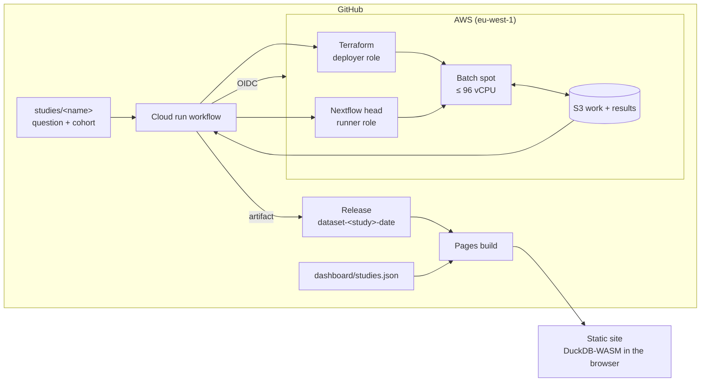

# Dashboard v2 and README Implementation Plan

> **For agentic workers:** REQUIRED SUB-SKILL: Use superpowers:subagent-driven-development (recommended) or superpowers:executing-plans to implement this plan task-by-task. Steps use checkbox (`- [ ]`) syntax for tracking.

**Goal:** Turn the single-dataset dashboard into a story-first site (Home, one page per study with
findings and linked figures, Explore, Method) backed by one release per study, and rewrite the
repository README around the architecture.

**Architecture:** Each study release carries its Parquet tables plus `cohort.parquet` (design
variables and reference calls) and `study.json` (story text, run facts, agreement), produced by a
new `amrtools study-bundle` command at publish time. `dashboard/studies.json` pins one release per
study; the Pages build downloads them all into `data/<study>/`. The browser loads every study into
one DuckDB with a `study` column (views are `UNION ALL BY NAME`), and every page is the same
queries with a study filter. Selection state lives in the URL hash.

**Tech Stack:** Python 3.12 (amrtools, pyarrow), bash, React 19 + TypeScript 5.9, Vite 8,
DuckDB-WASM 1.32 (browser) / @duckdb/node-api (tests), Observable Plot 0.6.17, world-atlas 2 +
topojson-client 3 (new), vitest 5, Playwright 1.64.

**Spec:** `docs/superpowers/specs/2026-10-09-dashboard-v2-design.md`

## Global Constraints

- *Klebsiella pneumoniae* only; the home page says so.
- Static site on GitHub Pages; no server, no external map or font service at runtime.
- Release tags for studies: `dataset-<study>-YYYY-MM-DD`; older `dataset-YYYY-MM-DD` tags stay valid.
- No change to the pipeline or the Parquet schema (1.2.0); extra release files sit beside the tables.
- Story text is hand-written in `studies/<name>/story.md`; the site never generates interpretation.
- Carbapenemase families, fixed order everywhere: KPC, NDM, OXA-48-like, VIM, IMP, other, none.
- Family colours (Okabe-Ito, unchanged): KPC `#D55E00`, NDM `#0072B2`, OXA-48-like `#E69F00`,
  VIM `#009E73`, IMP `#CC79A7`, other `#56B4E9`, none `#BBBBBB` (neutral, not a category hue).
- Every chart: hover tooltip with exact count and n; legend when ≥ 2 series; caption with n.
- Light and dark mode; palettes validated for both surfaces with the dataviz validator.
- Pushes, releases and publishes need the user's OK first; no Claude attribution in commits or PRs.
- Python lines ≤ 100 chars (ruff); TypeScript passes `npm run typecheck` and `npm run lint`.

## Review Focus

1. A study with no `cohort.csv` (or a cohort without clone/period) — study page must still render
   (figures that need clone/period hide with a note), Explore must work. Test in Task 4.
2. A genome in two studies — counts and joins must never double it within one study. Test in Task 4.
3. A URL with unknown keys, a removed study, or malformed values — fall back to defaults, never a
   blank page. Test in Task 5.
4. Country names with no map shape (small states, "Kosovo") — dot omitted, count shown in the
   caption, nothing crashes. Test in Task 7.
5. A study release missing `study.json` or with a wrong schema major — clear error on that study's
   card/page only, other studies still load. Test in Task 6.

---

## File Structure

| File | Responsibility |
|---|---|
| `src/amrtools/study.py` (new) | Parse `story.md`; build `cohort.parquet` and `study.json` (run facts, agreement) |
| `src/amrtools/cli.py` | `study-bundle` subcommand |
| `studies/carbapenemase-clones/story.md` (new) | Study 1 background and findings |
| `studies/carbapenemase-clones/study.yaml` | Reference column mapping |
| `scripts/publish-dataset.sh` | `--study`: bundle, study tag, update `dashboard/studies.json` |
| `dashboard/studies.json` (new, replaces `dataset.txt`) | Pinned release per study |
| `.github/workflows/pages.yml` | Download every pinned release into `public/data/<study>/` |
| `dashboard/src/data/studies.ts` (new) | Types and loaders for `studies.json` / `study.json` |
| `dashboard/src/data/tables.ts` (new) | SQL creating the multi-study base views |
| `dashboard/src/data/db.ts` | Register every study's files, create views |
| `dashboard/src/data/sql/views.sql` | `study` keys, cohort join, curated year, family list/combo |
| `dashboard/src/data/sql/*.sql` | Joins on `(study, sample)`; new figure queries |
| `dashboard/src/data/filters.ts` | New filter keys and WHERE clauses |
| `dashboard/src/data/queries.ts` | Figure queries |
| `dashboard/src/data/countries.ts` + `country-codes.json` (new) | Country name → ISO numeric for the map |
| `dashboard/scripts/country_codes.py` (new) | Generates `country-codes.json` from pycountry |
| `dashboard/src/state/url.ts` (new) | Route and filters ⇄ hash |
| `dashboard/src/state/useHashState.ts` (new) | Hook: current route/filters, navigate, setFilters |
| `dashboard/src/theme.ts` (new) + `styles.css` | Tokens, dark mode, family colours |
| `dashboard/src/text.ts` (new) | Tiny inline markup (`*em*`, `**strong**`, `[text](url)`) |
| `dashboard/src/components/*` | Figures (Heatmap, PeriodBars, CountryMap, AgreementMatrix), FilterChips, StatTiles, PipelineDiagram, StudyCard, Header, RichText |
| `dashboard/src/pages/*` (new) | Home, StudyPage, Explore (old App body), Method |
| `dashboard/src/App.tsx` | Load studies, DB, theme; route to pages |
| `dashboard/tests/fixtures/make_fixture.py` | Two studies with cohort, study.json, studies.json |
| `README.md`, `dashboard/README.md` | Rewrite / update |

---

### Task 1: `amrtools study-bundle`

**Files:**
- Create: `src/amrtools/study.py`, `tests/python/test_study_bundle.py`
- Modify: `src/amrtools/cli.py`

**Interfaces:**
- Produces:
  - `parse_story(text: str) -> dict` → `{"title", "question", "focus", "background": [str], "findings": [{"id": str, "figure": str | None, "title": str, "text": str}]}`
  - `read_study_yaml(path: Path) -> dict[str, str]` (flat `key: value`)
  - `FAMILIES = ("KPC", "NDM", "OXA-48-like", "VIM", "IMP", "other")`; `family_of(symbol: str) -> str`
  - `build_bundle(study_dir: Path, dataset_dir: Path, run_dir: Path | None, out_dir: Path) -> dict` writes `out_dir/cohort.parquet` and `out_dir/study.json`, returns the study.json dict
  - CLI: `amrtools study-bundle --study-dir DIR --dataset DIR [--run-dir DIR] --out DIR`
- `study.json` shape:
  ```json
  {"study": "...", "title": "...", "question": "...", "focus": "...",
   "background": ["..."], "findings": [{"id": "...", "figure": "heatmap", "title": "...", "text": "..."}],
   "reference": {"name": "..."} | null,
   "run": {"run_id": "...", "selected": 156, "analysed": 152, "failed": ["..."],
           "cost_usd": 4.76, "cost_per_genome_usd": 0.0305, "instance_hours": 17.8,
           "wall_time_minutes": 129} ,
   "agreement": {"st": {"agree": 151, "total": 152}, "carbapenemase_family": {"agree": 150, "total": 152},
                 "family_matrix": [{"ours": "KPC", "reference": "KPC", "genomes": 70}],
                 "disagreements": [{"sample": "...", "field": "st", "ours": "...", "reference": "..."}]} | null,
   "versions": {"amrfinder": ["4.2.7"], "amrfinder_db": ["2026-08-07.1"]}}
  ```
  `run` fields that need `--run-dir` (`cost_*`, `instance_hours`, `wall_time_minutes`) are `null` without it.
- `cohort.parquet` columns (always present, `NULL` when the study has no such column):
  `sample` (string), `clone`, `period`, `year` (int16), `country`, `ref_st`, `ref_carbapenemases`,
  plus any other `cohort.csv` columns as strings. Without `cohort.csv`: one row per sample, all
  other columns NULL.
- `story.md` format:
  ```markdown
  ---
  title: Carbapenemases in high-risk K. pneumoniae clones over time
  question: Which carbapenemase families travel with ...?
  focus: carbapenemases
  ---
  ## Background
  Paragraph one.

  Paragraph two.

  ## Findings
  ### Each clone has a signature carbapenemase {#heatmap}
  Text of the finding.
  ```
  `{#id}` names the figure: one of `heatmap`, `periods`, `map`, `agreement`; a finding without it has `figure: null`. Finding `id` = slug of the title.
- `study.yaml` reference keys (flat): `reference_name`, `reference_st_column`, `reference_carbapenemases_column`.

- [ ] **Step 1: Write the failing tests**

```python
"""amrtools study-bundle: cohort.parquet and study.json for a study release."""

import json
from pathlib import Path

import pyarrow.parquet as pq
import pytest
from dataset_helpers import gene_record, sample_record, summary_record, write_run

from amrtools.cli import main
from amrtools.study import build_bundle, family_of, parse_story

STORY = """---
title: Carbapenemases in clones
question: Which families travel with which clones?
focus: carbapenemases
---
## Background
First *paragraph*.

Second paragraph.

## Findings
### Each clone has a signature carbapenemase {#heatmap}
ST258 carries KPC.

### A finding without a figure
Text.
"""

YAML = """title: t
organism: Klebsiella_pneumoniae
max_isolates: 10
reference_name: Pathogenwatch (AMRnet)
reference_st_column: amrnet_st
reference_carbapenemases_column: amrnet_carbapenemases
"""

COHORT = """run_accession,clone,period,year,country,amrnet_st,amrnet_carbapenemases
S1,ST258/512,2013-2017,2015,Greece,ST258,KPC-2
S2,ST147,2018 or later,2019,India,ST147,-
S3,ST147,2018 or later,2020,India,ST147,NDM-1
"""

TRACE = (
    "task_id\tname\tstatus\tsubmit\tduration\n"
    "1\tISOLATE:FASTP (S1)\tCOMPLETED\t2026-10-09 10:00:00.000\t2m 0s\n"
    "2\tISOLATE:SHOVILL (S1)\tCOMPLETED\t2026-10-09 10:30:00.000\t1h 5m 30s\n"
)


def _study(tmp_path, cohort=True) -> Path:
    d = tmp_path / "studies" / "demo"
    d.mkdir(parents=True)
    (d / "story.md").write_text(STORY)
    (d / "study.yaml").write_text(YAML)
    if cohort:
        (d / "cohort.csv").write_text(COHORT)
    return d


def _dataset(tmp_path) -> Path:
    samples = [sample_record("S1"), sample_record("S2"),
               sample_record("S3", analysis_status="failed")]  # fmt: skip
    genes = [gene_record("S1", gene_symbol="blaKPC-2"),
             gene_record("S2", gene_symbol="blaNDM-1")]  # S2: we find NDM, AMRnet none  # fmt: skip
    summaries = [summary_record("S1", st="ST258"), summary_record("S2", st="ST11")]
    return write_run(tmp_path / "ds", samples, genes, summaries)


def _run_dir(tmp_path) -> Path:
    r = tmp_path / "run"
    r.mkdir()
    (r / "cost.json").write_text(json.dumps({"summary": {
        "instances": 2, "instance_hours": 1.5, "total_usd": 0.12, "samples": 3,
        "per_sample_usd": 0.04}}))  # fmt: skip
    (r / "trace.tsv").write_text(TRACE)
    return r


def test_parse_story():
    story = parse_story(STORY)
    assert story["title"] == "Carbapenemases in clones"
    assert story["focus"] == "carbapenemases"
    assert story["background"] == ["First *paragraph*.", "Second paragraph."]
    assert story["findings"] == [
        {"id": "each-clone-has-a-signature-carbapenemase", "figure": "heatmap",
         "title": "Each clone has a signature carbapenemase", "text": "ST258 carries KPC."},
        {"id": "a-finding-without-a-figure", "figure": None,
         "title": "A finding without a figure", "text": "Text."},
    ]  # fmt: skip


def test_story_with_unknown_figure_is_refused():
    with pytest.raises(ValueError, match="figure"):
        parse_story(STORY.replace("{#heatmap}", "{#pie}"))


@pytest.mark.parametrize(("symbol", "family"), [
    ("blaKPC-2", "KPC"), ("blaNDM-5", "NDM"), ("blaOXA-48", "OXA-48-like"),
    ("blaOXA-232", "OXA-48-like"), ("blaVIM-1", "VIM"), ("blaIMP-4", "IMP"), ("blaGES-5", "other"),
])  # fmt: skip
def test_family_of(symbol, family):
    assert family_of(symbol) == family


def test_bundle_writes_cohort_and_study_json(tmp_path):
    out = tmp_path / "out"
    info = build_bundle(_study(tmp_path), _dataset(tmp_path), _run_dir(tmp_path), out)
    cohort = pq.read_table(out / "cohort.parquet").to_pylist()
    assert cohort[0] == {"sample": "S1", "clone": "ST258/512", "period": "2013-2017", "year": 2015,
                         "country": "Greece", "ref_st": "ST258",
                         "ref_carbapenemases": "KPC-2"}  # fmt: skip
    assert json.loads((out / "study.json").read_text()) == info
    assert info["study"] == "demo" and info["reference"] == {"name": "Pathogenwatch (AMRnet)"}
    assert info["run"]["selected"] == 3 and info["run"]["analysed"] == 2
    assert info["run"]["failed"] == ["S3"]
    assert info["run"]["cost_usd"] == 0.12 and info["run"]["instance_hours"] == 1.5
    assert info["run"]["wall_time_minutes"] == 96  # 10:00 -> 10:30 + 65.5 min, rounded
    agreement = info["agreement"]
    assert agreement["st"] == {"agree": 1, "total": 2}
    assert agreement["carbapenemase_family"] == {"agree": 1, "total": 2}
    assert {"sample": "S2", "field": "st", "ours": "ST11", "reference": "ST147"} in agreement[
        "disagreements"
    ]
    assert {"sample": "S2", "field": "carbapenemase_family", "ours": "NDM",
            "reference": "none"} in agreement["disagreements"]  # fmt: skip
    assert {"ours": "KPC", "reference": "KPC", "genomes": 1} in agreement["family_matrix"]
    assert info["versions"] == {"amrfinder": ["4.2.7"], "amrfinder_db": ["2026-09-30.1"]}


def test_study_without_cohort_or_run_dir(tmp_path):
    out = tmp_path / "out"
    info = build_bundle(_study(tmp_path, cohort=False), _dataset(tmp_path), None, out)
    cohort = pq.read_table(out / "cohort.parquet")
    assert cohort.column("sample").to_pylist() == ["S1", "S2", "S3"]
    assert cohort.column("clone").null_count == 3
    assert info["agreement"] is None
    assert info["run"]["cost_usd"] is None and info["run"]["wall_time_minutes"] is None


def test_cli(tmp_path):
    out = tmp_path / "out"
    args = ["study-bundle", "--study-dir", str(_study(tmp_path)), "--dataset",
            str(_dataset(tmp_path)), "--run-dir", str(_run_dir(tmp_path)), "--out", str(out)]  # fmt: skip
    assert main(args) == 0
    assert (out / "study.json").exists() and (out / "cohort.parquet").exists()
```

- [ ] **Step 2: Run to see it fail**

Run: `.venv/bin/pytest -q tests/python/test_study_bundle.py`
Expected: collection error, `ModuleNotFoundError: No module named 'amrtools.study'`

- [ ] **Step 3: Implement `src/amrtools/study.py`**

```python
"""Per-study release files: cohort.parquet (design variables, reference calls) and study.json
(hand-written story, run facts, agreement with the reference), built at publish time."""

import csv
import json
import re
from datetime import datetime
from pathlib import Path

import pyarrow as pa
import pyarrow.parquet as pq

from amrtools.validate import validate_dir

FIGURES = ("heatmap", "periods", "map", "agreement")
FAMILIES = ("KPC", "NDM", "OXA-48-like", "VIM", "IMP", "other")
STANDARD = ("clone", "period", "year", "country", "ref_st", "ref_carbapenemases")
_PREFIXES = (("blaKPC", "KPC"), ("blaNDM", "NDM"), ("blaOXA", "OXA-48-like"),
             ("blaVIM", "VIM"), ("blaIMP", "IMP"))  # fmt: skip


def family_of(symbol: str) -> str:
    """Carbapenemase family of an AMRFinderPlus symbol (same rule as the dashboard's SQL)."""
    return next((family for prefix, family in _PREFIXES if symbol.startswith(prefix)), "other")


def read_study_yaml(path: Path) -> dict[str, str]:
    """Flat `key: value` lines (study.yaml stays this simple on purpose)."""
    values = {}
    for line in Path(path).read_text().splitlines():
        if line.strip() and not line.lstrip().startswith("#") and ":" in line:
            key, _, value = line.partition(":")
            values[key.strip()] = value.strip()
    return values


def _slug(text: str) -> str:
    return re.sub(r"[^a-z0-9]+", "-", text.lower()).strip("-")


def parse_story(text: str) -> dict:
    front, _, body = text.partition("\n---\n")
    meta = {}
    for line in front.removeprefix("---\n").splitlines():
        key, _, value = line.partition(":")
        meta[key.strip()] = value.strip()
    sections = re.split(r"^## +(.+)$", body, flags=re.M)
    named = {sections[i].strip(): sections[i + 1] for i in range(1, len(sections) - 1, 2)}
    background = [p.strip() for p in named.get("Background", "").split("\n\n") if p.strip()]
    findings = []
    for block in re.split(r"^### +", named.get("Findings", ""), flags=re.M)[1:]:
        heading, _, text_ = block.partition("\n")
        match = re.search(r"\s*\{#([a-z]+)\}\s*$", heading)
        figure = match[1] if match else None
        if figure is not None and figure not in FIGURES:
            raise ValueError(f"unknown figure {{#{figure}}}; use one of {', '.join(FIGURES)}")
        title = heading[: match.start()].strip() if match else heading.strip()
        findings.append({"id": _slug(title), "figure": figure, "title": title,
                         "text": " ".join(text_.split())})  # fmt: skip
    return {"title": meta.get("title", ""), "question": meta.get("question", ""),
            "focus": meta.get("focus", ""), "background": background, "findings": findings}  # fmt: skip


def _cohort(study_dir: Path, samples: list[str], settings: dict[str, str]) -> pa.Table:
    path = study_dir / "cohort.csv"
    if not path.exists():
        rows = [{"sample": s} for s in samples]
    else:
        renames = {"run_accession": "sample",
                   settings.get("reference_st_column", ""): "ref_st",
                   settings.get("reference_carbapenemases_column", ""): "ref_carbapenemases"}  # fmt: skip
        with open(path, newline="") as handle:
            rows = [{renames.get(k, k): (v or None) for k, v in row.items()}
                    for row in csv.DictReader(handle)]  # fmt: skip
    extra = sorted({k for r in rows for k in r} - {"sample", *STANDARD})
    columns = {"sample": [r["sample"] for r in rows]}
    for name in (*STANDARD, *extra):
        values = [r.get(name) for r in rows]
        columns[name] = (
            [int(v) if v is not None else None for v in values] if name == "year" else values
        )
    types = {name: (pa.int16() if name == "year" else pa.string()) for name in columns}
    return pa.table({n: pa.array(v, type=types[n]) for n, v in columns.items()})


def _families(genes: list[dict]) -> dict[str, str]:
    """Sample -> sorted '+'-joined carbapenemase families (AMR subtype, carbapenem subclass)."""
    found: dict[str, set[str]] = {}
    for g in genes:
        if g["element_subtype"] == "AMR" and g["drug_subclass"] == "CARBAPENEM":
            found.setdefault(g["sample"], set()).add(family_of(g["gene_symbol"]))
    return {s: "+".join(sorted(f)) for s, f in found.items()}


def _reference_families(text: str | None) -> str:
    if not text or text.strip() in ("-", ""):
        return "none"
    alleles = [a.strip().split("*")[0].split("^")[0] for a in text.split(";") if a.strip()]
    return "+".join(sorted({family_of("bla" + a) for a in alleles}))


def _agreement(cohort: pa.Table, summary: list[dict], genes: list[dict]) -> dict | None:
    ref = {r["sample"]: r for r in cohort.to_pylist()}
    if not any(r["ref_st"] or r["ref_carbapenemases"] for r in ref.values()):
        return None
    ours_fam = _families(genes)
    st = fam = 0
    matrix: dict[tuple[str, str], int] = {}
    disagreements = []
    for row in summary:
        sample, theirs = row["sample"], ref.get(row["sample"], {})
        if row["st"] == theirs.get("ref_st"):
            st += 1
        else:
            disagreements.append({"sample": sample, "field": "st", "ours": row["st"],
                                  "reference": theirs.get("ref_st")})  # fmt: skip
        ours, reference = (
            ours_fam.get(sample, "none"),
            _reference_families(theirs.get("ref_carbapenemases")),
        )
        matrix[(ours, reference)] = matrix.get((ours, reference), 0) + 1
        if ours == reference:
            fam += 1
        else:
            disagreements.append({"sample": sample, "field": "carbapenemase_family",
                                  "ours": ours, "reference": reference})  # fmt: skip
    return {"st": {"agree": st, "total": len(summary)},
            "carbapenemase_family": {"agree": fam, "total": len(summary)},
            "family_matrix": [{"ours": o, "reference": r, "genomes": n}
                              for (o, r), n in sorted(matrix.items())],
            "disagreements": disagreements}  # fmt: skip


def _duration_minutes(text: str) -> float:
    units = {"ms": 1 / 60000, "s": 1 / 60, "m": 1, "h": 60, "d": 1440}
    return sum(float(n) * units[u] for n, u in re.findall(r"([\d.]+)(ms|s|m|h|d)", text))


def _run_facts(run_dir: Path | None) -> dict:
    facts = {"cost_usd": None, "cost_per_genome_usd": None, "instance_hours": None,
             "wall_time_minutes": None}  # fmt: skip
    if run_dir is None:
        return facts
    cost = json.loads((run_dir / "cost.json").read_text())["summary"]
    facts |= {"cost_usd": round(cost["total_usd"], 2),
              "cost_per_genome_usd": round(cost["per_sample_usd"], 4),
              "instance_hours": round(cost["instance_hours"], 1)}  # fmt: skip
    trace = list(csv.DictReader(open(run_dir / "trace.tsv"), delimiter="\t"))
    starts = [datetime.strptime(t["submit"], "%Y-%m-%d %H:%M:%S.%f") for t in trace]
    ends = [
        s.timestamp() / 60 + _duration_minutes(t["duration"])
        for s, t in zip(starts, trace, strict=True)
    ]
    facts["wall_time_minutes"] = round(max(ends) - min(s.timestamp() / 60 for s in starts))
    return facts


def build_bundle(study_dir: Path, dataset_dir: Path, run_dir: Path | None, out_dir: Path) -> dict:
    study_dir, out_dir = Path(study_dir), Path(out_dir)
    tables = validate_dir(dataset_dir)
    samples = tables["samples"].select(["sample", "analysis_status"]).to_pylist()
    summary = tables["run_summary"].select(["sample", "st"]).to_pylist()
    genes = tables["amr_genes"].to_pylist()
    settings = read_study_yaml(study_dir / "study.yaml")
    cohort = _cohort(study_dir, [s["sample"] for s in samples], settings)
    run_ids = sorted(set(tables["samples"].column("run_id").to_pylist()))
    info = {"study": study_dir.name, **parse_story((study_dir / "story.md").read_text()),
            "reference": {"name": settings["reference_name"]} if settings.get("reference_name") else None,
            "run": {"run_id": ",".join(run_ids), "selected": len(samples), "analysed": len(summary),
                    "failed": [s["sample"] for s in samples if s["analysis_status"] == "failed"],
                    **_run_facts(Path(run_dir) if run_dir else None)},
            "agreement": _agreement(cohort, summary, genes),
            "versions": {"amrfinder": sorted({g["amrfinder_version"] for g in genes}),
                         "amrfinder_db": sorted({g["amrfinder_db_version"] for g in genes})}}  # fmt: skip
    out_dir.mkdir(parents=True, exist_ok=True)
    pq.write_table(cohort, out_dir / "cohort.parquet", compression="zstd")
    (out_dir / "study.json").write_text(json.dumps(info, indent=2) + "\n")
    return info
```

Note: `_agreement` returns `None` when the cohort has no reference columns filled (study without a
reference). The `reference_name` key is absent from studies without a reference.

- [ ] **Step 4: Wire the CLI** in `src/amrtools/cli.py`: import `from amrtools.study import build_bundle`;
  add the parser next to `run-status`:

```python
    bundle = commands.add_parser("study-bundle", help="cohort.parquet and study.json for a release")
    bundle.add_argument("--study-dir", type=Path, required=True)
    bundle.add_argument("--dataset", type=Path, required=True)
    bundle.add_argument("--run-dir", type=Path)
    bundle.add_argument("--out", type=Path, required=True, dest="bundle_out")
```

  handler (register `"study-bundle": _run_study_bundle` in `commands`):

```python
def _run_study_bundle(args: argparse.Namespace) -> None:
    info = build_bundle(args.study_dir, args.dataset, args.run_dir, args.bundle_out)
    print(
        f"{info['study']}: {info['run']['analysed']}/{info['run']['selected']} analysed",
        file=sys.stderr,
    )
```

  (`dest="bundle_out"` because `main()` creates `args.outdir` for other commands.)

- [ ] **Step 5: Run tests, lint, commit**

Run: `.venv/bin/pytest -q tests/python && .venv/bin/ruff check . && .venv/bin/ruff format --check .`
Expected: all pass (fix long lines by splitting, not by `noqa`).

```bash
git add src/amrtools/study.py src/amrtools/cli.py tests/python/test_study_bundle.py
git commit -m "feat(amrtools): study-bundle writes cohort.parquet and study.json for a study release"
```

---

### Task 2: Study 1 story and reference mapping

**Files:**
- Create: `studies/carbapenemase-clones/story.md`
- Modify: `studies/carbapenemase-clones/study.yaml`, `studies/README.md`
- Test: `tests/python/test_study_bundle.py` (add one test)

**Interfaces:**
- Consumes: `parse_story`, `read_study_yaml` (Task 1).

- [ ] **Step 1: Failing test** — append to `tests/python/test_study_bundle.py`:

```python
REPO = Path(__file__).resolve().parents[2]


def test_every_study_story_parses_and_names_known_figures():
    from amrtools.study import FIGURES, read_study_yaml

    for story in sorted((REPO / "studies").glob("*/story.md")):
        parsed = parse_story(story.read_text())
        assert parsed["title"] and parsed["question"] and parsed["background"], story
        assert all(f["figure"] in (*FIGURES, None) for f in parsed["findings"]), story
        settings = read_study_yaml(story.parent / "study.yaml")
        if (story.parent / "cohort.csv").exists() and settings.get("reference_name"):
            header = (story.parent / "cohort.csv").read_text().splitlines()[0].split(",")
            assert settings["reference_st_column"] in header, story
    assert (REPO / "studies" / "carbapenemase-clones" / "story.md").exists()
```

Run: `.venv/bin/pytest -q tests/python/test_study_bundle.py -k every_study` → FAIL (story.md missing).

- [ ] **Step 2: Add to `studies/carbapenemase-clones/study.yaml`** (after `max_isolates`):

```yaml
reference_name: Pathogenwatch (AMRnet table, snapshot 2025-08-05)
reference_st_column: amrnet_st
reference_carbapenemases_column: amrnet_carbapenemases
```

- [ ] **Step 3: Write `studies/carbapenemase-clones/story.md`** (numbers from `RESULTS.md`; keep
  them in sync if the bundle's agreement differs — Task 3 step 6 checks):

```markdown
---
title: Carbapenemases in high-risk K. pneumoniae clones over time
question: Which carbapenemase families travel with ST11, ST147, ST258/512 and ST307, and how has that changed since 2012?
focus: carbapenemases
---
## Background
Carbapenems are last-line antibiotics for *Klebsiella pneumoniae* infections. **Carbapenemases**
are enzymes that destroy them; the main families are KPC, NDM, OXA-48-like, VIM and IMP. Their
genes usually sit on plasmids, so they can move between strains.

A few lineages, the "high-risk clones", cause a large share of resistant infections worldwide:
ST258 (with its close relative ST512), ST11, ST147 and ST307. This study asks which carbapenemase
families each clone carries and whether that has changed over time.

The genomes are public (ENA), chosen from the Pathogenwatch collection as 13 per clone and period
(2012 or earlier, 2013–2017, 2018 or later), one per country per group, without looking at their
resistance genes. Public genomes over-represent resistant and outbreak isolates, so these shares
describe this sample, not how common each enzyme is.

## Findings
### Each clone has a signature carbapenemase {#heatmap}
ST258/512 is the KPC clone: every genome carries KPC, in every period. ST11 carries KPC in about
a third of genomes and NDM in a growing share; ST147 mostly NDM and OXA-48-like.

### ST147 switched to NDM and OXA-48-like; ST307 is gaining carbapenemases {#periods}
ST147 genomes without a carbapenemase fall from 46% (2012 or earlier) to 8% (2018 or later), while
NDM rises from 15% to 42% and the early VIM genomes disappear. ST307, best known for the CTX-M-15
ESBL, goes from 8% to 46% carbapenemase carriers. ST11 keeps KPC and doubles its NDM share.

### Where these genomes come from {#map}
55 countries, at most one genome per country in each clone and period. The map shows where
genomes were sequenced and shared, not where resistance is most common.

### The calls agree with an independent reference {#agreement}
Our sequence types agree with Pathogenwatch for 151 of 152 genomes and our carbapenemase families
for 150 of 152. One difference is a genome where we find blaGES-5, a carbapenemase the reference
table does not list.
```

- [ ] **Step 4: Document the files** in `studies/README.md`: add bullets
  `story.md` (front matter + `## Background` + `## Findings` with `### Title {#figure}`; figures:
  heatmap, periods, map, agreement) and the three `reference_*` keys in `study.yaml`.

- [ ] **Step 5: Run and commit**

Run: `.venv/bin/pytest -q tests/python/test_study_bundle.py` → PASS.

```bash
git add studies tests/python/test_study_bundle.py
git commit -m "docs(studies): carbapenemase-clones story and reference mapping"
```

---

### Task 3: Publishing a study and building every pinned release

**Files:**
- Modify: `scripts/publish-dataset.sh`, `.github/workflows/pages.yml`,
  `tests/python/test_publish_dataset.py`, `tests/python/test_workflows.py`
- Create: `dashboard/studies.json`; Delete: `dashboard/dataset.txt`

**Interfaces:**
- Consumes: `amrtools study-bundle` (Task 1).
- Produces:
  - `dashboard/studies.json`: `[{"study": "<name>", "release": "<tag>"}]` (ordered; publishing an existing study replaces its entry in place, a new study is appended).
  - `publish-dataset.sh [--dry-run] [--notes FILE] [--study NAME] <run-id> [artifact]`: with `--study`, tag `dataset-<study>-YYYY-MM-DD`, release assets also include `cohort.parquet` and `study.json`; requires a Cloud run artifact with exactly one `runs/*/*/results/parquet`; env `STUDIES_PIN` overrides the studies.json path (tests), `STUDIES_DIR` overrides `studies/`.
  - Pages build puts each release in `dashboard/public/data/<study>/` and copies `studies.json` to `dashboard/public/data/studies.json`.

- [ ] **Step 1: Failing tests.** In `tests/python/test_publish_dataset.py` add (reuse `_setup`; give
  the fake artifact a run folder with `cost.json` and `trace.tsv`, and a fake `studies/` dir):

```python
def _study_setup(tmp_path):
    env, _ = _setup(tmp_path)
    run = next((tmp_path / "artifact").rglob("results")).parent
    (run / "cost.json").write_text(json.dumps({"summary": {"instances": 1, "instance_hours": 0.5,
        "total_usd": 0.05, "samples": 2, "per_sample_usd": 0.025}}))  # fmt: skip
    (run / "trace.tsv").write_text("task_id\tname\tstatus\tsubmit\tduration\n"
                                   "1\tX\tCOMPLETED\t2026-10-09 10:00:00.000\t5m 0s\n")  # fmt: skip
    study = tmp_path / "studies" / "study-x"
    study.mkdir(parents=True)
    (study / "study.yaml").write_text(
        "title: t\norganism: Klebsiella_pneumoniae\nmax_isolates: 5\n"
    )
    (study / "story.md").write_text("---\ntitle: T\nquestion: Q?\nfocus: f\n---\n"
                                    "## Background\nB.\n\n## Findings\n### F {#heatmap}\nT.\n")  # fmt: skip
    pin = tmp_path / "studies.json"
    pin.write_text(json.dumps([{"study": "other", "release": "dataset-other-2026-10-01"},
                               {"study": "study-x", "release": "dataset-2026-10-09"}]))  # fmt: skip
    env |= {"STUDIES_PIN": str(pin), "STUDIES_DIR": str(tmp_path / "studies")}
    return env, pin


def test_study_release_carries_bundle_and_updates_studies_json(tmp_path):
    env, pin = _study_setup(tmp_path)
    proc = subprocess.run(["bash", str(SCRIPT), "--study", "study-x", "123", "cloud-run-study-x-123"],
                          env=env, capture_output=True, text=True, timeout=120)  # fmt: skip
    assert proc.returncode == 0, proc.stdout + proc.stderr
    entries = json.loads(pin.read_text())
    assert [e["study"] for e in entries] == ["other", "study-x"]  # replaced in place
    tag = entries[1]["release"]
    assert tag.startswith("dataset-study-x-")
    assets = sorted((tmp_path / "assets.txt").read_text().split())
    assert assets == ["amr_genes.parquet", "cohort.parquet", "manifest.json",
                      "run_summary.parquet", "samples.parquet", "study.json"]  # fmt: skip


def test_study_needs_a_story(tmp_path):
    env, _ = _study_setup(tmp_path)
    (tmp_path / "studies" / "study-x" / "story.md").unlink()
    proc = subprocess.run(["bash", str(SCRIPT), "--study", "study-x", "123", "cloud-run-study-x-123"],
                          env=env, capture_output=True, text=True, timeout=120)  # fmt: skip
    assert proc.returncode != 0 and "story.md" in proc.stderr
```

  Add `import json` at the top. In `tests/python/test_workflows.py` replace
  `test_site_dataset_is_pinned_in_git` with:

```python
def test_site_studies_are_pinned_in_git():
    """The site shows the releases listed in dashboard/studies.json; publishing is a commit.

    Pages deployments are identified by commit: a release alone (same commit) redeployed the
    old site on 2026-10-09.
    """
    entries = json.loads((ROOT / "dashboard" / "studies.json").read_text())
    assert entries and all(re.fullmatch(r"[a-z0-9][a-z0-9-]*", e["study"]) for e in entries)
    assert all(
        re.fullmatch(r"dataset-([a-z0-9-]+-)?\d{4}-\d{2}-\d{2}", e["release"]) for e in entries
    )
    assert not (ROOT / "dashboard" / "dataset.txt").exists()
    pages = _load("pages.yml")
    assert "release" not in pages[True]
    steps = pages["jobs"]["build"]["steps"]
    script = next(s for s in steps if s.get("name", "").startswith("Download"))["run"]
    assert "dashboard/studies.json" in script and "public/data/$study" in script
```

  (add `import json`). Run both files → the new tests FAIL.

- [ ] **Step 2: `dashboard/studies.json`** (study 1's current release until Task 11 republishes it):

```json
[{ "study": "carbapenemase-clones", "release": "dataset-2026-10-09" }]
```

  `git rm dashboard/dataset.txt`.

- [ ] **Step 3: `pages.yml`** — replace the "Download the pinned dataset release" step:

```yaml
      - name: Download the pinned study releases
        env:
          GH_TOKEN: ${{ github.token }}
        run: |
          mkdir -p dashboard/public/data
          cp dashboard/studies.json dashboard/public/data/studies.json
          jq -r '.[] | "\(.study) \(.release)"' dashboard/studies.json | while read -r study tag; do
            [[ "$study" =~ ^[a-z0-9][a-z0-9-]*$ && "$tag" =~ ^dataset-([a-z0-9-]+-)?[0-9]{4}-[0-9]{2}-[0-9]{2}$ ]] \
              || { echo "::error::bad studies.json entry: $study $tag"; exit 1; }
            gh release download "$tag" --dir "dashboard/public/data/$study" \
              --pattern '*.parquet' --pattern manifest.json --pattern study.json
          done
```

  Update the workflow's header comment: "The site shows the releases listed in
  dashboard/studies.json …". (Releases without `study.json`/`cohort.parquet`, e.g.
  `dataset-2026-10-09`, still download; the site shows a "republish" note for them — Task 6.)

- [ ] **Step 4: `publish-dataset.sh`** — changes:
  - options: `--study NAME` (`study=""`); `pin="${STUDIES_PIN:-$root/dashboard/studies.json}"`;
    `studies_dir="${STUDIES_DIR:-$root/studies}"`.
  - with `--study`: `[ -f "$studies_dir/$study/story.md" ] || { echo "error: $studies_dir/$study/story.md is required to publish a study" >&2; exit 1; }` before any download;
    `TAG="dataset-$study-$(date -u +%F)"`.
  - after `amrtools validate "$dataset"` with `--study`: the artifact must have exactly one run
    folder (`[ ${#runs[@]} -eq 1 ]`, else error "one Cloud run per study release"); run
    `amrtools study-bundle --study-dir "$studies_dir/$study" --dataset "$dataset" --run-dir "$(dirname "$(dirname "${runs[0]}")")" --out "$dataset"`.
  - release assets: `"$dataset"/*.parquet "$dataset/manifest.json"` plus `"$dataset/study.json"` when present (`cohort.parquet` is matched by `*.parquet`).
  - pin update (replaces `echo "$TAG" > "$pin"`):

```bash
python3 - "$pin" "${study:-site}" "$TAG" <<'PY'
import json, sys
path, study, tag = sys.argv[1:]
entries = json.load(open(path))
for entry in entries:
    if entry["study"] == study:
        entry["release"] = tag
        break
else:
    entries.append({"study": study, "release": tag})
open(path, "w").write(json.dumps(entries, indent=2) + "\n")
PY
```

  - final echo: `published $TAG and pinned it in ${pin#"$root"/}` + the existing "Next: commit…" line.
  - Remove the old `DATASET_PIN` handling and update the existing two tests' env
    (`DATASET_PIN` → `STUDIES_PIN` with a JSON list file; the non-study publish appends a
    `"site"` entry — assert that instead of the old text pin).

- [ ] **Step 5: Run tests** `.venv/bin/pytest -q tests/python` → PASS; `shellcheck` if installed.

- [ ] **Step 6: Dry-run against the real study 1 artifact** (read-only, no release):

```bash
PATH=.venv/bin:$PATH scripts/publish-dataset.sh --dry-run --study carbapenemase-clones \
  37919795836 cloud-run-carbapenemase-clones-37919795836
```

  Expected: "dry run: would publish dataset-carbapenemase-clones-…". Then build the bundle into
  the scratchpad with `amrtools study-bundle` on the downloaded artifact and compare
  `study.json`'s agreement with `RESULTS.md` (151/152, 150/152). If they differ (e.g. exact ST
  equality vs. the earlier ST258/512 grouping), correct `RESULTS.md` and `story.md` to the
  bundle's numbers and say so in the commit message.

- [ ] **Step 7: Commit**

```bash
git add -A scripts .github/workflows/pages.yml dashboard/studies.json tests/python studies
git commit -m "feat: one release per study (cohort.parquet, study.json); studies.json pins them for the site"
```

---

### Task 4: Multi-study data layer and two-study fixture

**Files:**
- Create: `dashboard/src/data/tables.ts`, `dashboard/src/data/studies.ts`
- Modify: `dashboard/src/data/sql/views.sql`, `timeline.sql`, `top_elements.sql`,
  `isolates.sql`, `dashboard/src/data/db.ts`, `dashboard/tests/nodeConnection.ts`,
  `dashboard/tests/fixtures/make_fixture.py`, `dashboard/package.json` (`fixture-data`),
  existing tests in `dashboard/tests/*.test.ts`
- Test: `dashboard/tests/views.test.ts`, `dashboard/tests/studies.test.ts` (new)

**Interfaces:**
- Produces:
  - `tables.ts`: `export const BASE_TABLES = ["samples", "amr_genes", "run_summary", "cohort"] as const;`
    `export function baseViewsSql(studies: string[], fileFor: (study: string, table: string) => string): string[]`
    — one `CREATE OR REPLACE VIEW <table> AS SELECT '<study>' AS study, * FROM read_parquet('<file>') UNION ALL BY NAME …` per table. Study names are validated against `/^[a-z0-9][a-z0-9-]*$/` (they become SQL literals); throws otherwise.
  - `studies.ts`: `StudyEntry`, `StudyInfo`, `Finding`, `FigureId`, `Agreement`, `RunFacts` types
    (shape of Task 1's `study.json`); `loadStudies(dataUrl: string, fetchFn?): Promise<StudyEntry[]>`;
    `loadStudyInfo(dataUrl: string, study: string, fetchFn?): Promise<StudyInfo | null>` (null when the release has no study.json).
  - `isolates` view gains: `study`, `clone`, `period`, `family_list` (VARCHAR[]; `['none']` when no
    carbapenemase), `family_combo` (e.g. `NDM+OXA-48-like`, `none`); `collection_year` falls back
    to the cohort's `year`. `carbapenemases`, `esbl`, `amr_elements` carry `study`.
  - `fixtureConnection()` loads every study listed in the fixture's `studies.json`.
  - Fixture: `tests/fixtures/data/studies.json` = `study-a`, `study-b`. `study-a` = F1–F7 as today
    plus `cohort.csv` (clones `ST258/512`, `ST147`, `ST11`, `ST307`; periods; F4's year only in the
    cohort, 2016) and references (one ST and one family disagreement); `study-b` = F1 (shared) and
    G1 (ST15, Kenya, NDM), no cohort.csv, no reference.

- [ ] **Step 1: Fixture generator.** Rewrite `make_fixture.py` `main()` to write
  `tests/fixtures/data/<study>/` for two studies using `write_run` + `build_dataset` (as now) and
  then `amrtools.study.build_bundle(study_dir, out, None, out)` with a temporary study dir
  holding `study.yaml`, `story.md` (`STORY_A`, `STORY_B` constants with one finding per figure
  for study-a and one finding without figure for study-b) and, for study-a, `cohort.csv`:

```python
COHORT_A = """run_accession,clone,period,year,country,ref_st_col,ref_carb_col
F1,ST258/512,2013-2017,2019,Germany,ST258,KPC-2
F2,ST147,2018 or later,2021,Germany,ST147,NDM-5
F3,ST147,2018 or later,2021,India,ST147,NDM-1;OXA-232
F4,ST11,2013-2017,2016,United States,ST23,-
F5,ST11,2018 or later,2020,India,ST15,KPC-3
F6,ST307,2012 or earlier,2018,Côte d'Ivoire,ST15,KPC-2
F7,ST307,2018 or later,2020,Nigeria,ST307,-
"""
```

  (Against the fixture's run_summary STs — F1 ST258, F2/F3 ST147, F4 ST23, F5 ST11, F6 ST15 —
  F5 is the one ST disagreement (reference ST15, ours ST11) → 5 of 6; F6 is the one family
  disagreement (reference KPC, ours none) → 5 of 6. F7 failed, so 6 are compared. The cohort's
  clone labels are design labels and may differ from the called ST, as in real cohorts.) `study.yaml` for study-a sets `reference_name: Fixture reference`,
  `reference_st_column: ref_st_col`, `reference_carbapenemases_column: ref_carb_col`. Write
  `tests/fixtures/data/studies.json` = `[{"study":"study-a","release":"dataset-study-a-2026-10-01"},{"study":"study-b","release":"dataset-study-b-2026-10-02"}]`.
  study-b: samples F1 (same record as study-a) and G1 (`country="Kenya"`, year 2022, summary ST15,
  gene `blaNDM-1` CARBAPENEM).
  Update `package.json`: `"fixture-data": "rm -rf public/data && mkdir -p public/data && cp -R tests/fixtures/data/. public/data/"`
  (no TAG file any more; the footer reads releases from studies.json).
  Run: `.venv/bin/python dashboard/tests/fixtures/make_fixture.py` and
  `.venv/bin/amrtools validate dashboard/tests/fixtures/data/study-a` → valid.

- [ ] **Step 2: Failing tests.** `dashboard/tests/studies.test.ts`:

```ts
import { readFile } from "node:fs/promises";
import { fileURLToPath } from "node:url";
import { describe, expect, it } from "vitest";
import { loadStudies, loadStudyInfo } from "../src/data/studies";
import { baseViewsSql } from "../src/data/tables";

const DATA = new URL("./fixtures/data/", import.meta.url);
const fileFetch = (async (url: string | URL) => {
  try {
    return new Response(await readFile(fileURLToPath(url)));
  } catch {
    return new Response("", { status: 404 });
  }
}) as typeof fetch;

describe("studies", () => {
  it("lists the pinned studies in order", async () => {
    expect((await loadStudies(DATA.href, fileFetch)).map((s) => s.study)).toEqual(["study-a", "study-b"]);
  });
  it("loads a study's story and facts", async () => {
    const info = await loadStudyInfo(DATA.href, "study-a", fileFetch);
    expect(info?.findings.map((f) => f.figure)).toContain("heatmap");
    expect(info?.agreement?.st).toEqual({ agree: 5, total: 6 });
  });
  it("returns null for a release without study.json", async () => {
    expect(await loadStudyInfo(DATA.href, "no-such-study", fileFetch)).toBeNull();
  });
  it("refuses study names that are not slugs", () => {
    expect(() => baseViewsSql(["ok", "x'); DROP"], (s, t) => `${s}/${t}`)).toThrow(/study name/);
  });
});
```

  Extend `dashboard/tests/views.test.ts` (keep existing cases but filter to study-a where they
  count rows):

```ts
  it("keeps studies apart: a genome in two studies is one row per study", async () => {
    const conn = await fixtureConnection();
    await createViews(conn);
    const rows = await conn.query<{ study: string; n: number }>(
      "SELECT study, count(*)::INTEGER AS n FROM isolates WHERE sample = 'F1' GROUP BY study ORDER BY study",
    );
    expect(rows).toEqual([{ study: "study-a", n: 1 }, { study: "study-b", n: 1 }]);
  });

  it("adds clone, period, family list and combo, and the cohort's year where ENA has none", async () => {
    const conn = await fixtureConnection();
    await createViews(conn);
    const [f3] = await conn.query("SELECT clone, period, family_list, family_combo FROM isolates WHERE study='study-a' AND sample='F3'");
    expect(f3).toEqual({ clone: "ST147", period: "2018 or later", family_list: ["NDM", "OXA-48-like"], family_combo: "NDM+OXA-48-like" });
    const [f4] = await conn.query("SELECT collection_year, family_list, family_combo FROM isolates WHERE study='study-a' AND sample='F4'");
    expect(f4).toEqual({ collection_year: 2016, family_list: ["none"], family_combo: "none" });
    const [g1] = await conn.query("SELECT clone, period FROM isolates WHERE study='study-b' AND sample='G1'");
    expect(g1).toEqual({ clone: null, period: null }); // study without cohort.csv still works
  });
```

  Run: `cd dashboard && npx vitest run` → new tests FAIL.

- [ ] **Step 3: `src/data/tables.ts`**

```ts
export const BASE_TABLES = ["samples", "amr_genes", "run_summary", "cohort"] as const;
const SLUG = /^[a-z0-9][a-z0-9-]*$/;

/** One view per table over every study's Parquet file, with a `study` column. */
export function baseViewsSql(studies: string[], fileFor: (study: string, table: string) => string): string[] {
  for (const study of studies) if (!SLUG.test(study)) throw new Error(`Invalid study name: ${study}`);
  return BASE_TABLES.map((table) => {
    const parts = studies.map((s) => `SELECT '${s}' AS study, * FROM read_parquet('${fileFor(s, table)}')`);
    return `CREATE OR REPLACE VIEW ${table} AS ${parts.join(" UNION ALL BY NAME ")}`;
  });
}
```

  Note: study 1's current release has no `cohort.parquet`. `db.ts`/`nodeConnection` only pass a
  study to `baseViewsSql` for `cohort` if its file exists; if no study has one, create
  `CREATE VIEW cohort AS SELECT NULL::VARCHAR AS study, NULL::VARCHAR AS sample, NULL::VARCHAR AS clone, NULL::VARCHAR AS period, NULL::SMALLINT AS year, NULL::VARCHAR AS country, NULL::VARCHAR AS ref_st, NULL::VARCHAR AS ref_carbapenemases WHERE FALSE`.
  Implement this as a third parameter `hasCohort: (study: string) => boolean` (default `() => true`)
  that filters the study list for the `cohort` table only and emits the empty view when none remain.

- [ ] **Step 4: `src/data/studies.ts`**

```ts
export type FigureId = "heatmap" | "periods" | "map" | "agreement";
export interface StudyEntry { study: string; release: string }
export interface Finding { id: string; figure: FigureId | null; title: string; text: string }
export interface Disagreement { sample: string; field: "st" | "carbapenemase_family"; ours: string | null; reference: string | null }
export interface Agreement {
  st: { agree: number; total: number };
  carbapenemase_family: { agree: number; total: number };
  family_matrix: { ours: string; reference: string; genomes: number }[];
  disagreements: Disagreement[];
}
export interface RunFacts {
  run_id: string; selected: number; analysed: number; failed: string[];
  cost_usd: number | null; cost_per_genome_usd: number | null; instance_hours: number | null; wall_time_minutes: number | null;
}
export interface StudyInfo {
  study: string; title: string; question: string; focus: string;
  background: string[]; findings: Finding[];
  reference: { name: string } | null; run: RunFacts; agreement: Agreement | null;
  versions: { amrfinder: string[]; amrfinder_db: string[] };
}

export async function loadStudies(dataUrl: string, fetchFn: typeof fetch = fetch): Promise<StudyEntry[]> {
  const response = await fetchFn(new URL("studies.json", dataUrl).href);
  if (!response.ok) throw new Error(`No studies.json (HTTP ${response.status})`);
  return (await response.json()) as StudyEntry[];
}

export async function loadStudyInfo(dataUrl: string, study: string, fetchFn: typeof fetch = fetch): Promise<StudyInfo | null> {
  const response = await fetchFn(new URL(`${study}/study.json`, dataUrl).href);
  return response.ok ? ((await response.json()) as StudyInfo) : null;
}
```

- [ ] **Step 5: SQL.** `views.sql` — replace the four views:

```sql
CREATE OR REPLACE VIEW carbapenemases AS
SELECT DISTINCT
    study, sample, gene_symbol,
    CASE
        WHEN gene_symbol LIKE 'blaKPC%' THEN 'KPC'
        WHEN gene_symbol LIKE 'blaNDM%' THEN 'NDM'
        WHEN gene_symbol LIKE 'blaVIM%' THEN 'VIM'
        WHEN gene_symbol LIKE 'blaIMP%' THEN 'IMP'
        WHEN gene_symbol LIKE 'blaOXA%' THEN 'OXA-48-like'
        ELSE 'other'
    END AS family
FROM amr_genes
WHERE element_subtype = 'AMR' AND drug_subclass = 'CARBAPENEM';

CREATE OR REPLACE VIEW esbl AS
SELECT DISTINCT study, sample, gene_symbol FROM amr_genes WHERE gene_symbol LIKE 'blaCTX-M%';

CREATE OR REPLACE VIEW sample_families AS
SELECT study, sample, list_sort(list_distinct(list(family))) AS family_list
FROM carbapenemases GROUP BY ALL;

CREATE OR REPLACE VIEW isolates AS
SELECT
    s.study, s.sample, s.run_accession, s.country, s.region,
    coalesce(s.collection_year::INTEGER, k.year::INTEGER) AS collection_year,
    s.source_category, r.st, r.qc_status, k.clone, k.period,
    (SELECT string_agg(c.gene_symbol, ', ' ORDER BY c.gene_symbol) FROM carbapenemases c WHERE c.study = s.study AND c.sample = s.sample) AS carbapenemase_genes,
    (SELECT string_agg(e.gene_symbol, ', ' ORDER BY e.gene_symbol) FROM esbl e WHERE e.study = s.study AND e.sample = s.sample) AS ctxm_genes,
    coalesce(f.family_list, ['none']) AS family_list,
    coalesce(array_to_string(f.family_list, '+'), 'none') AS family_combo,
    f.family_list IS NOT NULL AS has_carbapenemase,
    EXISTS (SELECT 1 FROM esbl e WHERE e.study = s.study AND e.sample = s.sample) AS has_ctxm
FROM samples s
JOIN run_summary r USING (study, sample)
LEFT JOIN cohort k USING (study, sample)
LEFT JOIN sample_families f USING (study, sample);
```

  Keep `amr_elements` as is (`g.*` carries `study`). `timeline.sql`: `WITH shown AS (SELECT study, sample, collection_year FROM isolates {{where}})`, `LEFT JOIN carbapenemases c USING (study, sample)`, `count(DISTINCT (s.study, s.sample))::INTEGER`. `top_elements.sql`: `shown AS (SELECT study, sample FROM isolates {{where}})`, `JOIN shown USING (study, sample)`, `count(DISTINCT (e.study, e.sample))`. `isolates.sql`: select `study` first and `ORDER BY study, sample`.

- [ ] **Step 6: `db.ts` and `nodeConnection.ts`** use `baseViewsSql`. `db.ts`:
  `openDashboardDb(dataUrl)` → loads `studies.json`, each study's `manifest.json` (via
  `loadManifest(new URL(`${study}/`, dataUrl).href)`; a study whose manifest fails is left out and
  reported in `failed: {study, error}[]`), registers each existing file
  `${study}/${table}.parquet` with `db.registerFileURL(`${study}__${table}.parquet`, url, HTTP, false)`
  (cohort only if a HEAD/GET of the URL is ok), runs `baseViewsSql(okStudies, (s, t) => `${s}__${t}.parquet`, hasCohort)`,
  then `createViews`. Returns `{ conn, studies: StudyEntry[], infos: Record<string, StudyInfo | null>, manifests: Record<string, Manifest>, failed, counts }`.
  `nodeConnection.fixtureConnection()` reads the fixture's `studies.json` and uses
  `baseViewsSql(studies, (s, t) => `${FIXTURE}${s}/${t}.parquet`, (s) => existsSync(`${FIXTURE}${s}/cohort.parquet`))`.

- [ ] **Step 7: Adapt existing tests** so their numbers stay meaningful: in
  `queries.test.ts` use `const A = { ...EMPTY_FILTERS, studies: ["study-a"] }` (and `ALL` likewise)
  — `studies` is added to `Filters` in Task 5; until then filter with a test-local WHERE or do Task 5
  step 3 first (filters change) — **order inside this task: Steps 1–6, then Task 5 Step 3, then this
  step**. `connection.test.ts`: `SELECT count(*) FROM samples WHERE study='study-a'` → 7. Run
  `npx vitest run` → PASS; `npm run typecheck && npm run lint` → clean.

- [ ] **Step 8: Commit**

```bash
git add dashboard
git commit -m "feat(dashboard): load every pinned study into one DuckDB with a study column; cohort join"
```

---

### Task 5: Filters and URL state

**Files:**
- Modify: `dashboard/src/data/filters.ts`, `dashboard/src/data/queries.ts` (option keys)
- Create: `dashboard/src/state/url.ts`, `dashboard/src/state/useHashState.ts`
- Test: `dashboard/tests/filters.test.ts`, `dashboard/tests/url.test.ts` (new)

**Interfaces:**
- Produces:
  - `Filters` = existing fields + `studies: string[]; clones: string[]; periods: string[]; families: string[]; combos: string[]`; `EMPTY_FILTERS` has them empty.
  - `ListFilter` = `"studies" | "countries" | "sources" | "sts" | "clones" | "periods" | "combos"` (column filters); `families` is special (carries any of).
  - `OptionKey` = `"studies" | "countries" | "sources" | "sts"` (used by `options()`; `OPTION_COLUMNS` gets `studies: "study"`).
  - `toWhere(filters, omit?)` adds `family_list && [?, …]`-style clause: `len(list_intersect(family_list, [?, ?])) > 0`.
  - `url.ts`: `type Route = { page: "home" } | { page: "study"; study: string } | { page: "explore" } | { page: "method" }`;
    `parseHash(hash: string): { route: Route; filters: Partial<Filters> }`;
    `toHash(route: Route, filters?: Partial<Filters>): string`.
    Keys: `study` (studies), `country`, `source`, `st`, `clone`, `period`, `family`, `combo`
    (comma-separated, each `encodeURIComponent`), `from`/`to` (years), `carb=1`, `qc=all`.
    Only non-default values are written. Unknown keys and malformed values are ignored.
  - `useHashState(): { route: Route; filters: Filters; navigate(route: Route, filters?: Partial<Filters>): void; setFilters(f: Filters): void }`
    — filters = `{ ...EMPTY_FILTERS, ...parsed }`; `navigate` sets `location.hash` (new history entry);
    `setFilters` uses `history.replaceState` (no history spam) and updates state.

- [ ] **Step 1: Failing tests** `dashboard/tests/url.test.ts`:

```ts
import { describe, expect, it } from "vitest";
import { EMPTY_FILTERS } from "../src/data/filters";
import { parseHash, toHash } from "../src/state/url";

describe("url state", () => {
  it("parses routes", () => {
    expect(parseHash("").route).toEqual({ page: "home" });
    expect(parseHash("#/").route).toEqual({ page: "home" });
    expect(parseHash("#/study/carbapenemase-clones").route).toEqual({ page: "study", study: "carbapenemase-clones" });
    expect(parseHash("#/explore").route).toEqual({ page: "explore" });
    expect(parseHash("#/method").route).toEqual({ page: "method" });
  });
  it("round-trips a selection", () => {
    const filters = { ...EMPTY_FILTERS, clones: ["ST147"], families: ["NDM", "OXA-48-like"], yearMin: 2013, hideQcWarnings: false };
    const hash = toHash({ page: "study", study: "s1" }, filters);
    expect(hash).toBe("#/study/s1?clone=ST147&family=NDM,OXA-48-like&from=2013&qc=all");
    expect({ ...EMPTY_FILTERS, ...parseHash(hash).filters }).toEqual(filters);
  });
  it("encodes values with commas and spaces", () => {
    const hash = toHash({ page: "explore" }, { countries: ["Korea, Republic of", "Côte d'Ivoire"] });
    expect(parseHash(hash).filters.countries).toEqual(["Korea, Republic of", "Côte d'Ivoire"]);
  });
  it("ignores unknown keys, bad numbers and unknown pages", () => {
    expect(parseHash("#/nope?x=1").route).toEqual({ page: "home" });
    expect(parseHash("#/explore?from=abc&bogus=1&clone=").filters).toEqual({});
    expect(parseHash("#/study/").route).toEqual({ page: "home" });
  });
});
```

  `filters.test.ts` additions:

```ts
  it("filters by clone, period, combo and carried family", () => {
    const where = toWhere({ ...EMPTY_FILTERS, clones: ["ST147"], families: ["NDM", "VIM"], combos: ["none"], hideQcWarnings: false });
    expect(where.sql).toBe("WHERE clone IN (?) AND family_combo IN (?) AND len(list_intersect(family_list, [?, ?])) > 0");
    expect(where.params).toEqual(["ST147", "none", "NDM", "VIM"]);
  });
```

  And a query-level test in `queries.test.ts`: `isolateRows(conn, { ...A, families: ["NDM"] })`
  returns F2 and F3 only. Run `npx vitest run` → FAIL.

- [ ] **Step 2: Implement `filters.ts`** — `LIST_COLUMNS` becomes
  `{ studies: "study", countries: "country", sources: "source_category", sts: "st", clones: "clone", periods: "period", combos: "family_combo" }`
  iterated in that order; after the loop:

```ts
  if (filters.families.length) {
    clauses.push(`len(list_intersect(family_list, [${filters.families.map(() => "?").join(", ")}])) > 0`);
    params.push(...filters.families);
  }
```

  then the year, carbapenemase and QC clauses as today. `queries.ts`: rename the
  `options()` key type to `OptionKey`, add `studies: "study"` to `OPTION_COLUMNS`.

- [ ] **Step 3: Implement `url.ts`**

```ts
import { EMPTY_FILTERS, type Filters } from "../data/filters";

export type Route = { page: "home" } | { page: "study"; study: string } | { page: "explore" } | { page: "method" };

const LISTS = { study: "studies", country: "countries", source: "sources", st: "sts", clone: "clones", period: "periods", family: "families", combo: "combos" } as const;
type ListKey = (typeof LISTS)[keyof typeof LISTS];

function parseRoute(path: string): Route {
  const parts = path.replace(/^\/+/, "").split("/");
  if (parts[0] === "study" && /^[a-z0-9][a-z0-9-]*$/.test(parts[1] ?? "")) return { page: "study", study: parts[1] };
  if (parts[0] === "explore") return { page: "explore" };
  if (parts[0] === "method") return { page: "method" };
  return { page: "home" };
}

export function parseHash(hash: string): { route: Route; filters: Partial<Filters> } {
  const [path, query = ""] = hash.replace(/^#/, "").split("?");
  const filters: Partial<Filters> = {};
  for (const pair of query.split("&")) {
    const [key, raw = ""] = pair.split("=");
    if (key in LISTS) {
      const values = raw.split(",").filter(Boolean).map(decodeURIComponent);
      if (values.length) filters[LISTS[key as keyof typeof LISTS] as ListKey] = values;
    } else if ((key === "from" || key === "to") && /^\d{4}$/.test(raw)) {
      filters[key === "from" ? "yearMin" : "yearMax"] = Number(raw);
    } else if (key === "carb" && raw === "1") filters.carbapenemaseOnly = true;
    else if (key === "qc" && raw === "all") filters.hideQcWarnings = false;
  }
  return { route: parseRoute(path), filters };
}

export function toHash(route: Route, filters: Partial<Filters> = {}): string {
  const f = { ...EMPTY_FILTERS, ...filters };
  const path = route.page === "home" ? "/" : route.page === "study" ? `/study/${route.study}` : `/${route.page}`;
  const parts: string[] = [];
  for (const [key, field] of Object.entries(LISTS)) {
    if (f[field].length) parts.push(`${key}=${f[field].map(encodeURIComponent).join(",")}`);
  }
  if (f.yearMin !== null) parts.push(`from=${f.yearMin}`);
  if (f.yearMax !== null) parts.push(`to=${f.yearMax}`);
  if (f.carbapenemaseOnly) parts.push("carb=1");
  if (!f.hideQcWarnings) parts.push("qc=all");
  return `#${path}${parts.length ? `?${parts.join("&")}` : ""}`;
}
```

  (`encodeURIComponent` encodes `,` as `%2C`, so commas inside values survive the split.)

- [ ] **Step 4: `useHashState.ts`**

```ts
import { useCallback, useEffect, useState } from "react";
import { EMPTY_FILTERS, type Filters } from "../data/filters";
import { parseHash, type Route, toHash } from "./url";

function read() {
  const { route, filters } = parseHash(window.location.hash);
  return { route, filters: { ...EMPTY_FILTERS, ...filters } };
}

export function useHashState() {
  const [state, setState] = useState(read);
  useEffect(() => {
    const onChange = () => setState(read());
    window.addEventListener("hashchange", onChange);
    return () => window.removeEventListener("hashchange", onChange);
  }, []);
  const navigate = useCallback((route: Route, filters: Partial<Filters> = {}) => {
    window.location.hash = toHash(route, filters);
    window.scrollTo(0, 0);
  }, []);
  const setFilters = useCallback((filters: Filters) => {
    setState((s) => {
      window.history.replaceState(null, "", toHash(s.route, filters));
      return { ...s, filters };
    });
  }, []);
  return { ...state, navigate, setFilters };
}
```

- [ ] **Step 5: Run and commit** — `npx vitest run`, `npm run typecheck`, `npm run lint` → clean.

```bash
git add dashboard
git commit -m "feat(dashboard): clone, period and carbapenemase-family filters; selection in the URL"
```

---

### Task 6: Figure queries, theme, app shell and routing

**Files:**
- Create: `dashboard/src/data/sql/heatmap.sql`, `period_mix.sql`, `countries.sql`;
  `dashboard/src/theme.ts`; `dashboard/src/text.ts`; `dashboard/src/components/Header.tsx`;
  `dashboard/src/pages/{Home,StudyPage,Explore,Method}.tsx` (Home/StudyPage/Method minimal here,
  completed in Tasks 8–10)
- Modify: `dashboard/src/data/queries.ts`, `dashboard/src/App.tsx`, `dashboard/src/styles.css`,
  `dashboard/src/useDashboard.ts` (takes base filters), `dashboard/src/components/Footer.tsx`
- Test: `dashboard/tests/queries.test.ts`, `dashboard/tests/text.test.ts` (new), e2e `tests/e2e/smoke.spec.ts`

**Interfaces:**
- Produces:
  - `familyHeatmap(conn, filters, byPeriod: boolean): Promise<HeatCell[]>`, `HeatCell = { clone: string; period: string; family: string; genomes: number; carriers: number; share: number }` (`period = "all"` when not by period; only cells with carriers > 0 are returned).
  - `periodMix(conn, filters): Promise<MixRow[]>`, `MixRow = { clone: string; period: string; combo: string; genomes: number; share: number }`.
  - `countryCounts(conn, filters): Promise<CountryRow[]>`, `CountryRow = { country: string; genomes: number; clones: string | null; families: string }`.
  - `FAMILY_ORDER = ["KPC", "NDM", "OXA-48-like", "VIM", "IMP", "other", "none"]`, `PERIOD_ORDER = ["2012 or earlier", "2013-2017", "2018 or later"]` exported from `theme.ts` with `familyColour(family: string): string` and `useTheme(): { theme: "light" | "dark"; toggle(): void }` (reads `localStorage` in try/catch, falls back to `prefers-color-scheme`, sets `document.documentElement.dataset.theme`).
  - `text.ts`: `inline(text: string): Span[]`, `type Span = { kind: "text" | "em" | "strong"; text: string } | { kind: "link"; text: string; href: string }`.
  - `useDashboard(conn, filters, includeIntrinsic)` — filters now come from `useHashState`, not internal state.
  - Study releases without `study.json` (the current `dataset-2026-10-09`) show their card and page
    with "This study's release predates study pages; republish it with `publish-dataset.sh --study`."

- [ ] **Step 1: Failing tests** in `queries.test.ts` (fixture study-a):

```ts
describe("study figures", () => {
  const A = { ...EMPTY_FILTERS, studies: ["study-a"], hideQcWarnings: false };
  it("heatmap: share of genomes per clone carrying each family", async () => {
    const cells = await familyHeatmap(conn, A, false);
    expect(cells.find((c) => c.clone === "ST147" && c.family === "NDM")).toEqual({ clone: "ST147", period: "all", family: "NDM", genomes: 2, carriers: 2, share: 1 });
    expect(cells.find((c) => c.clone === "ST147" && c.family === "OXA-48-like")?.share).toBe(0.5);
  });
  it("heatmap by period splits the denominator", async () => {
    const cells = await familyHeatmap(conn, A, true);
    expect(cells.filter((c) => c.clone === "ST11").map((c) => c.period).sort()).toEqual(["2013-2017", "2018 or later"]);
  });
  it("period mix: exclusive combos that sum to 1 per clone and period", async () => {
    const rows = await periodMix(conn, A);
    const st147 = rows.filter((r) => r.clone === "ST147" && r.period === "2018 or later");
    expect(st147.map((r) => [r.combo, r.share])).toEqual([["NDM", 0.5], ["NDM+OXA-48-like", 0.5]]);
  });
  it("countries with their clones and families", async () => {
    const rows = await countryCounts(conn, A);
    expect(rows.find((r) => r.country === "India")).toEqual({ country: "India", genomes: 2, clones: "ST11, ST147", families: "KPC, NDM, OXA-48-like" });
  });
});
```

  `tests/text.test.ts`:

```ts
import { describe, expect, it } from "vitest";
import { inline } from "../src/text";

describe("inline markup", () => {
  it("handles emphasis, strong and links", () => {
    expect(inline("A *K. pneumoniae* **KPC** [ENA](https://www.ebi.ac.uk/ena) end")).toEqual([
      { kind: "text", text: "A " }, { kind: "em", text: "K. pneumoniae" }, { kind: "text", text: " " },
      { kind: "strong", text: "KPC" }, { kind: "text", text: " " },
      { kind: "link", text: "ENA", href: "https://www.ebi.ac.uk/ena" }, { kind: "text", text: " end" },
    ]);
  });
  it("only allows http(s) links", () => {
    expect(inline("[x](javascript:alert(1))")).toEqual([{ kind: "text", text: "[x](javascript:alert(1))" }]);
  });
});
```

- [ ] **Step 2: SQL files**

`heatmap.sql`:
```sql
WITH shown AS (SELECT * FROM (SELECT clone, {{period}} AS period, family_list FROM isolates {{where}}) WHERE clone IS NOT NULL AND period IS NOT NULL),
totals AS (SELECT clone, period, count(*)::INTEGER AS genomes FROM shown GROUP BY ALL),
fam AS (SELECT clone, period, unnest(family_list) AS family FROM shown)
SELECT clone, period, family, genomes, count(*)::INTEGER AS carriers, (count(*) / genomes)::DOUBLE AS share
FROM fam JOIN totals USING (clone, period)
GROUP BY ALL
ORDER BY clone, period, family
```

`period_mix.sql`:
```sql
WITH shown AS (SELECT * FROM (SELECT clone, period, family_combo FROM isolates {{where}}) WHERE clone IS NOT NULL AND period IS NOT NULL)
SELECT clone, period, family_combo AS combo, count(*)::INTEGER AS genomes,
       (count(*) / sum(count(*)) OVER (PARTITION BY clone, period))::DOUBLE AS share
FROM shown
GROUP BY ALL
ORDER BY clone, period, combo
```

`countries.sql`:
```sql
WITH shown AS (SELECT * FROM (SELECT country, clone, family_list FROM isolates {{where}}) WHERE country IS NOT NULL)
SELECT country, count(*)::INTEGER AS genomes,
       nullif(array_to_string(list_sort(list_distinct(list(clone))), ', '), '') AS clones,
       array_to_string(list_sort(list_distinct(flatten(list(family_list)))), ', ') AS families
FROM shown
GROUP BY country
ORDER BY genomes DESC, country
```

  `queries.ts`: import the three `?raw` files; `familyHeatmap` replaces `{{period}}` with
  `period` or `'all'` before `run(...)`; `periodMix`, `countryCounts` call `run` directly.
  (`families` in `countries.sql` includes "none"; India's F2/F3 in the fixture have no "none".)

- [ ] **Step 3: `text.ts`**

```ts
export type Span = { kind: "text" | "em" | "strong"; text: string } | { kind: "link"; text: string; href: string };

const TOKEN = /\*\*([^*]+)\*\*|\*([^*]+)\*|\[([^\]]+)\]\((https?:\/\/[^)\s]+)\)/g;

export function inline(text: string): Span[] {
  const spans: Span[] = [];
  let last = 0;
  for (const m of text.matchAll(TOKEN)) {
    if (m.index > last) spans.push({ kind: "text", text: text.slice(last, m.index) });
    if (m[1] !== undefined) spans.push({ kind: "strong", text: m[1] });
    else if (m[2] !== undefined) spans.push({ kind: "em", text: m[2] });
    else spans.push({ kind: "link", text: m[3], href: m[4] });
    last = m.index + m[0].length;
  }
  if (last < text.length) spans.push({ kind: "text", text: text.slice(last) });
  return spans;
}
```

  `components/RichText.tsx` maps spans to `<em>`, `<strong>`, `<a href rel="noopener">`, text.

- [ ] **Step 4: Theme.** `styles.css`: replace `:root` with tokens and dark variants:

```css
:root {
  --bg: #f6f7f9; --surface: #ffffff; --ink: #1c2430; --muted: #5d6877; --line: #dde2e8;
  --accent: #0b6bcb; --chip: #e9eef5;
  --font: "Inter", system-ui, -apple-system, "Segoe UI", sans-serif;
  --mono: ui-monospace, "SF Mono", Menlo, Consolas, monospace;
  color-scheme: light;
}
@media (prefers-color-scheme: dark) {
  :root:not([data-theme="light"]) {
    --bg: #0f1419; --surface: #161c23; --ink: #e6eaef; --muted: #9aa5b1; --line: #2a333d;
    --accent: #5aa9f0; --chip: #1f2833; color-scheme: dark;
  }
}
:root[data-theme="dark"] {
  --bg: #0f1419; --surface: #161c23; --ink: #e6eaef; --muted: #9aa5b1; --line: #2a333d;
  --accent: #5aa9f0; --chip: #1f2833; color-scheme: dark;
}
body { margin: 0; background: var(--bg); color: var(--ink); font-family: var(--font); line-height: 1.5; }
code, .mono { font-family: var(--mono); font-size: 0.9em; }
```

  Keep the existing component rules, switching hard-coded colours to tokens (`--panel` → `--surface`).
  No external font: `Inter` is used only if installed locally.
  `theme.ts` exports `FAMILY_ORDER`, `PERIOD_ORDER`, the colour map from Global Constraints,
  `familyColour`, and `useTheme`. Observable Plot charts set `style: { background: "transparent", color: "var(--ink)" }`.

- [ ] **Step 5: Validate the palette** with the dataviz skill's validator (path from the skill's
  base directory):

```bash
node <dataviz>/scripts/validate_palette.js "#D55E00,#0072B2,#E69F00,#009E73,#CC79A7,#56B4E9" --mode light
node <dataviz>/scripts/validate_palette.js "#D55E00,#0072B2,#E69F00,#009E73,#CC79A7,#56B4E9" --mode dark
```

  If a check FAILs for dark, add dark-specific steps in `theme.ts` (`familyColour(family, theme)`)
  chosen with the validator's snap suggestions; record the validator output in the commit message.
  `none` (`#BBBBBB` light, `#5d6877` dark) is a neutral, not a category hue.

- [ ] **Step 6: App shell.** `App.tsx`:
  - `useHashState()` for route/filters; `useTheme()`.
  - `openDashboardDb(DATA_URL)` once → `{ conn, studies, infos, manifests, failed, counts }`.
  - `<Header studies infos route theme onToggleTheme />` (links: Home, each study's title, Explore,
    Method; theme toggle button with `aria-label="Switch to dark mode"`/`"Switch to light mode"`).
  - Route switch: `home` → `<Home …/>`, `study` → `<StudyPage …/>` (unknown study → "No such study" with a link home),
    `explore` → `<Explore …/>` (today's FilterBar + panels moved from App, using `useDashboard(conn, filters, includeIntrinsic)`
    and `setFilters`), `method` → `<Method />`.
  - `Footer` shows each study's release tag linked to its release notes (from `studies`) and the
    analysed/failed counts per study.
  - Explore's `FilterBar` gets a "Study" list (options key `studies`).
  Move the old App body into `pages/Explore.tsx` unchanged except for the filter source.

- [ ] **Step 7: e2e** — update `tests/e2e/smoke.spec.ts`: existing tests navigate to `./#/explore`
  and filter to study-a via `?study=study-a` where they assert counts (the old numbers hold:
  headline 5, Germany → 2, …). The footer test asserts "study-a: 6 analysed · 1 failed analysis"
  and a link named `dataset-study-a-2026-10-01` to `…/releases/tag/dataset-study-a-2026-10-01`. Add:

```ts
test("header navigates between pages and toggles dark mode", async ({ page }) => {
  await page.goto("./");
  await page.getByRole("link", { name: "Explore" }).click();
  await expect(page).toHaveURL(/#\/explore/);
  await page.getByRole("button", { name: /Switch to dark mode/ }).click();
  await expect(page.locator("html")).toHaveAttribute("data-theme", "dark");
});
```

- [ ] **Step 8: Run all checks and commit** — `npx vitest run`, `npm run typecheck`, `npm run lint`,
  `npx playwright test`.

```bash
git add dashboard
git commit -m "feat(dashboard): routes, header, theme and figure queries; Explore keeps today's view"
```

---

### Task 7: Figure components and linked selection

**Files:**
- Create: `dashboard/src/components/{Heatmap,PeriodBars,CountryMap,AgreementMatrix,FilterChips,FigureFrame}.tsx`,
  `dashboard/src/data/countries.ts`, `dashboard/src/data/country-codes.json`,
  `dashboard/scripts/country_codes.py`
- Modify: `dashboard/src/components/PlotFigure.tsx` (click → `onPick`), `dashboard/package.json`
  (`world-atlas@2.0.2`, `topojson-client@3.1.0`, `@types/topojson-client`; pin exact versions)
- Test: `dashboard/tests/countries.test.ts` (new), e2e in Task 8

**Interfaces:**
- Consumes: `HeatCell`, `MixRow`, `CountryRow` (Task 6), `Agreement` (Task 4), `Filters` (Task 5), `familyColour`, `FAMILY_ORDER`, `PERIOD_ORDER` (Task 6).
- Produces:
  - `PlotFigure({ options, summary, onPick?: (datum: unknown) => void })` — when `onPick` is set, a
    click on the figure calls it with `figure.value` (the datum under the pointer; Plot sets it for
    marks with `tip`), if any.
  - `Heatmap({ cells, selected: { clone?: string; family?: string }, onPick(clone, family) })`, with a
    "By period" toggle (`byPeriod` state lifted to the page; prop `byPeriod`, `onByPeriod`).
  - `PeriodBars({ rows, onPick(clone, period, combo) })`.
  - `CountryMap({ rows, onPick(country) })`.
  - `AgreementMatrix({ agreement, referenceName })`.
  - `FilterChips({ filters, onChange, keys })` — one removable chip per value of the listed keys,
    plus "Clear all".
  - `FigureFrame({ title, caption, children, table })` — figure title (the finding's takeaway is
    rendered by the page above it), caption with n, and a `<details>` "Show as table" with the
    figure's rows.
  - `countries.ts`: `isoNumeric(name: string): string | null` (from `country-codes.json`).

- [ ] **Step 1: Country codes.** `dashboard/scripts/country_codes.py` (run with the repo venv):

```python
"""Write src/data/country-codes.json: country name as amrtools writes it -> ISO 3166 numeric
(world-atlas feature ids). Run: .venv/bin/python dashboard/scripts/country_codes.py"""

import json
from pathlib import Path

import pycountry

OUT = Path(__file__).resolve().parents[1] / "src" / "data" / "country-codes.json"
codes = {getattr(c, "common_name", None) or c.name: c.numeric for c in pycountry.countries}
OUT.write_text(json.dumps(dict(sorted(codes.items())), ensure_ascii=False, indent=0) + "\n")
print(f"{len(codes)} countries -> {OUT}")
```

  Failing test `tests/countries.test.ts`:

```ts
import { describe, expect, it } from "vitest";
import { isoNumeric } from "../src/data/countries";

describe("country codes", () => {
  it("maps amrtools country names to ISO numeric ids", () => {
    expect(isoNumeric("Germany")).toBe("276");
    expect(isoNumeric("United States")).toBe("840");
    expect(isoNumeric("Côte d'Ivoire")).toBe("384");
    expect(isoNumeric("Atlantis")).toBeNull();
  });
});
```

  Run the script, implement `countries.ts` (`import codes from "./country-codes.json"`; `codes[name] ?? null`), test passes.

- [ ] **Step 2: `PlotFigure` click support**

```tsx
export function PlotFigure({ options, summary, onPick }: { options: Plot.PlotOptions; summary: string; onPick?: (d: unknown) => void }) {
  const ref = useRef<HTMLDivElement>(null);
  useEffect(() => {
    const figure = Plot.plot(options);
    const click = () => {
      const value = (figure as unknown as { value?: unknown }).value;
      if (onPick && value != null) onPick(value);
    };
    figure.addEventListener("click", click);
    if (onPick) figure.style.cursor = "pointer";
    ref.current?.replaceChildren(figure);
    return () => { figure.removeEventListener("click", click); figure.remove(); };
  }, [options, onPick]);
  return (
    <figure>
      <div ref={ref} />
      <figcaption className="sr-only">{summary}</figcaption>
    </figure>
  );
}
```

  Callers memoise `onPick` with `useCallback`.

- [ ] **Step 3: `Heatmap.tsx`** — Plot cell chart: `x: { domain: FAMILY_ORDER, label: null }`,
  `y: { domain: clones (sorted), label: null }`, `fx: "period"` when `byPeriod` (domain `PERIOD_ORDER`),
  `color: { type: "linear", domain: [0, 1], range: SEQUENTIAL[theme] }` where `theme.ts` exports
  `SEQUENTIAL = { light: ["#eef4fb", "#0b4f94"], dark: ["#1b2630", "#7cc0ff"] }` (one hue, light→dark;
  checked with the validator in Task 6 step 5), cells filled for all clone×family pairs (missing → share 0 so empty cells are visible),
  `Plot.text` with `${Math.round(share*100)}%` in `var(--ink)` / white by luminance, `tip` with
  `"{clone}: {carriers} of {genomes} genomes carry {family}"`; `onPick` → `onPick(d.clone, d.family)`.
  Selected cell gets a 2px `var(--ink)` stroke; others `fillOpacity: 0.35` when a selection exists.
  Toggle button "By period" / "All periods" above the chart.

- [ ] **Step 4: `PeriodBars.tsx`** — small multiples: `fx: "clone"`, `x: { domain: PERIOD_ORDER }`,
  `y: { percent: true, label: "% of genomes" }`, `Plot.barY(rows, Plot.stackY({ x: "period", y: "share", fill: (d) => d.combo, order: comboOrder }))`
  where each combo is coloured by its **first** family (`familyColour(combo.split("+")[0])`);
  multi-family combos (e.g. "NDM+OXA-48-like") use that colour at `fillOpacity: 0.55` so they read
  as a lighter shade of the same family, and the legend lists every combo present; `tip` shows combo,
  genomes and share; 2px surface gap via `stroke: "var(--surface)"`, `strokeWidth: 2`.
  `onPick` → `(d.clone, d.period, d.combo)`.

- [ ] **Step 5: `CountryMap.tsx`**

```tsx
import * as Plot from "@observablehq/plot";
import { useCallback, useMemo } from "react";
import { feature } from "topojson-client";
import world from "world-atlas/countries-110m.json";
import { isoNumeric } from "../data/countries";
import type { CountryRow } from "../data/queries";
import { PlotFigure } from "./PlotFigure";

// eslint-disable-next-line @typescript-eslint/no-explicit-any
const land = feature(world as any, (world as any).objects.countries) as unknown as GeoJSON.FeatureCollection;

export function CountryMap({ rows, onPick }: { rows: CountryRow[]; onPick: (country: string) => void }) {
  const { options, missing } = useMemo(() => {
    const byId = new Map(land.features.map((f) => [String(f.id), f]));
    const placed = rows.flatMap((r) => {
      const f = byId.get(isoNumeric(r.country) ?? "");
      return f ? [{ ...r, feature: f }] : [];
    });
    const missing = rows.filter((r) => !placed.some((p) => p.country === r.country));
    return {
      missing,
      options: {
        projection: "equal-earth",
        height: 420,
        style: { background: "transparent", color: "var(--ink)" },
        r: { range: [3, 18] },
        marks: [
          Plot.geo(land, { fill: "var(--chip)", stroke: "var(--line)", strokeWidth: 0.5 }),
          Plot.dot(placed, Plot.centroid({ geometry: (d) => d.feature, r: "genomes", fill: "var(--accent)", fillOpacity: 0.7, stroke: "var(--surface)", strokeWidth: 2, tip: true,
            title: (d) => `${d.country}: ${d.genomes} genomes\nclones: ${d.clones ?? "–"}\ncarbapenemases: ${d.families}` })),
        ],
      } as Plot.PlotOptions,
    };
  }, [rows]);
  const onPickRow = useCallback((d: unknown) => onPick((d as CountryRow).country), [onPick]);
  return (
    <>
      <PlotFigure options={options} summary={`${rows.length} countries`} onPick={onPickRow} />
      {missing.length > 0 && <p className="note">Not on the map (too small at this scale): {missing.map((m) => `${m.country} (${m.genomes})`).join(", ")}.</p>}
    </>
  );
}
```

  `tsconfig.json`: ensure `"resolveJsonModule": true`. Add `@types/geojson` if `GeoJSON` types are
  missing.

- [ ] **Step 6: `AgreementMatrix.tsx`** — two stat tiles (`ST 151/152 (99%)`, `Carbapenemase family 150/152 (99%)`),
  a Plot cell chart of `family_matrix` (x = reference, y = ours, both domain `FAMILY_ORDER` plus any
  combos present, diagonal cells outlined, text = genomes), and a table of `disagreements`
  (sample linked to `https://www.ebi.ac.uk/ena/browser/view/<sample>`, field, ours, reference).
  Renders "No reference calls for this study." when `agreement` is null.

- [ ] **Step 7: `FilterChips.tsx`** — buttons `"<label>: <value> ×"` (`aria-label="Remove <label> <value>"`)
  for keys `clones`, `periods`, `families` (label "carries"), `combos`, `countries`; "Clear all" resets those keys.

- [ ] **Step 8: Typecheck, lint, unit tests, build** — `npm run typecheck && npm run lint && npx vitest run && npm run build`. Commit:

```bash
git add dashboard
git commit -m "feat(dashboard): heatmap, period bars, country map and agreement figures with click-to-filter"
```

---

### Task 8: Study page

**Files:**
- Modify: `dashboard/src/pages/StudyPage.tsx`, `dashboard/src/styles.css`
- Test: `dashboard/tests/e2e/study.spec.ts` (new)

**Interfaces:**
- Consumes: everything from Tasks 4–7; `infos[study]`, `useDashboard`, `useHashState`.
- Produces: `StudyPage({ conn, study, info, filters, setFilters })`.

Layout (top to bottom): title, question (large), background paragraphs (`RichText`), "Findings" —
for each finding: `<section id={finding.id}>` with numbered `<h3>`, text, then its figure
(`heatmap` → Heatmap, `periods` → PeriodBars, `map` → CountryMap, `agreement` → AgreementMatrix;
`null` → nothing) inside `FigureFrame` with caption `n = <analysed genomes shown>`; then a sticky
`FilterChips` row and "Linked views": timeline, AMR elements, isolate table (from `useDashboard`
with `filters` + `studies: [study]`); then "How we know": cohort (selected/analysed/failed list),
reference agreement summary, run facts (cost total and per genome, instance-hours, wall time,
run id linked to the Actions run search), versions, caveats paragraph. Figures read the study's
filters **without their own dimension** so a selection highlights rather than empties itself
(heatmap ignores `clones`/`families`; period bars ignore `clones`/`periods`/`combos`; map ignores
`countries`). Picks set filters: heatmap → `{clones: [clone], families: [family]}` (toggle off
when re-clicked); period bars → `{clones: [clone], periods: [period], combos: [combo]}`; map →
`{countries: [country]}`.

- [ ] **Step 1: Failing e2e** `tests/e2e/study.spec.ts`:

```ts
import { expect, test } from "@playwright/test";

test("study page tells the story and links figures to the table", async ({ page }) => {
  await page.goto("./#/study/study-a?qc=all");
  await expect(page.getByRole("heading", { level: 1 })).toContainText("Fixture study A");
  await expect(page.getByRole("heading", { name: /signature carbapenemase/ })).toBeVisible();
  await expect(page.getByTestId("isolate-count")).toHaveText("6 isolates");
  // Click the ST147 x NDM heatmap cell (its tip title identifies it).
  await page.locator('[data-figure="heatmap"] svg [aria-label*="ST147"][aria-label*="NDM"]').first().click();
  await expect(page.getByRole("button", { name: "Remove clone ST147" })).toBeVisible();
  await expect(page.getByTestId("isolate-count")).toHaveText("2 isolates");
  await expect(page).toHaveURL(/clone=ST147&family=NDM/);
  // The URL restores the selection.
  await page.reload();
  await expect(page.getByTestId("isolate-count")).toHaveText("2 isolates");
  await page.getByRole("button", { name: "Clear all" }).click();
  await expect(page.getByTestId("isolate-count")).toHaveText("6 isolates");
});

test("a study without cohort or reference still renders", async ({ page }) => {
  await page.goto("./#/study/study-b");
  await expect(page.getByRole("heading", { level: 1 })).toContainText("Fixture study B");
  await expect(page.getByText("No reference calls for this study.")).toBeHidden(); // study-b has no agreement finding
  await expect(page.getByTestId("isolate-count")).toHaveText("2 isolates");
});
```

  Heatmap cells carry `ariaLabel: (d) => \`${d.clone} ${d.family} ${Math.round(d.share*100)}%\``
  (Plot `ariaLabel` channel) and the frame has `data-figure="heatmap"`. The isolate table's count
  element gets `data-testid="isolate-count"`. Fixture titles: `Fixture study A`, `Fixture study B`
  (set in `make_fixture.py` stories). Run `npx playwright test tests/e2e/study.spec.ts` → FAIL.

- [ ] **Step 2: Implement `StudyPage.tsx`** as described; page `<h1>` = `info.title`; when `info` is
  null render the "predates study pages" note plus the linked views (the page still works on
  today's release).

- [ ] **Step 3: Run e2e and all checks**, fix, then screenshot desktop (1400px) and phone (390px)
  of `#/study/study-a` with the fixture preview and inspect them (labels overlap? text readable in
  dark mode?). Fix layout issues before committing.

- [ ] **Step 4: Commit**

```bash
git add dashboard
git commit -m "feat(dashboard): study page with findings, linked figures and how-we-know section"
```

---

### Task 9: Home, Explore study filter and Method

**Files:**
- Modify: `dashboard/src/pages/Home.tsx`, `dashboard/src/pages/Explore.tsx`, `dashboard/src/pages/Method.tsx`
- Create: `dashboard/src/components/{StatTiles,PipelineDiagram,StudyCard}.tsx`
- Test: `dashboard/tests/e2e/home.spec.ts` (new)

**Interfaces:**
- Consumes: `studies`, `infos`, `counts` from `openDashboardDb`; `navigate`.
- Produces: `Home({ studies, infos, navigate })`, `Method()`.

Home: intro (two sentences: what, and "*Klebsiella pneumoniae* for now — a WHO critical-priority
pathogen"); `StatTiles` — genomes analysed (sum of `run.analysed`), cost per genome (median of
`cost_per_genome_usd` across studies with it, formatted `$0.031`), agreement (sum of agree / sum
of total for carbapenemase family, `99%`), studies (count); "How it works" — `PipelineDiagram`
(inline SVG, 5 boxes left→right with arrows: *Study* (question + cohort) → *GitHub Actions*
(one click, OIDC) → *AWS Batch spot* (~2 h, ~$5 / 150 genomes) → *Release* (validated Parquet) →
*This site* (DuckDB in your browser); text in `var(--ink)`, boxes `var(--surface)`/`var(--line)`,
stacks vertically under 700px) and five one-line steps; study cards (title, question, first
finding's title as key finding, analysed n, cost) linking to `#/study/<name>`.
Explore: FilterBar shows "Study" options; default shows all studies.
Method: static sections — pipeline steps and tools (fastp, Shovill, AMRFinderPlus `--plus`,
Kleborate) with versions from the infos; cloud (GitHub OIDC, Terraform, Batch spot ≤ 96 vCPU,
S3, compute destroyed after every run, budgets); validation (tests, reviews, agreement with
references); links to `README.md`, `infra/README.md`, `studies/`.

- [ ] **Step 1: Failing e2e** `tests/e2e/home.spec.ts`:

```ts
import { expect, test } from "@playwright/test";

test("home introduces the project and lists every study", async ({ page }) => {
  await page.goto("./");
  await expect(page.getByText(/Klebsiella pneumoniae/).first()).toBeVisible();
  await expect(page.getByRole("heading", { name: "How it works" })).toBeVisible();
  await expect(page.getByTestId("tile-genomes")).toHaveText("8"); // 6 + 2 analysed
  const cards = page.getByRole("link", { name: /Fixture study/ });
  await expect(cards).toHaveCount(2);
  await cards.first().click();
  await expect(page).toHaveURL(/#\/study\/study-a/);
});

test("explore spans both studies and filters by study", async ({ page }) => {
  await page.goto("./#/explore?qc=all");
  await expect(page.getByTestId("headline-isolates")).toHaveText("8");
  await page.getByRole("checkbox", { name: /study-b/ }).check();
  await expect(page.getByTestId("headline-isolates")).toHaveText("2");
});

test("method page renders", async ({ page }) => {
  await page.goto("./#/method");
  await expect(page.getByRole("heading", { name: /How the pipeline works/ })).toBeVisible();
});
```

- [ ] **Step 2: Implement** the three pages and components.
- [ ] **Step 3: Run all checks** (`vitest`, `typecheck`, `lint`, `playwright`) and screenshot home at
  1400px and 390px, light and dark; inspect and fix.
- [ ] **Step 4: Commit**

```bash
git add dashboard
git commit -m "feat(dashboard): home with how-it-works and study cards; explore across studies; method page"
```

---

### Task 10: Republish study 1 as a study release (live — ask first)

**Files:**
- Modify: `dashboard/studies.json`, `studies/carbapenemase-clones/RESULTS.md` (release link)

- [ ] **Step 1: Ask the user** for OK to publish Release `dataset-carbapenemase-clones-<today>`
  (public) from Cloud run 37919795836. Do not continue without an explicit yes.
- [ ] **Step 2: Publish**

```bash
PATH=.venv/bin:$PATH scripts/publish-dataset.sh --study carbapenemase-clones \
  --notes /path/to/notes.md 37919795836 cloud-run-carbapenemase-clones-37919795836
```

  Notes: same text as `dataset-2026-10-09`'s release notes, plus "Adds cohort.parquet and
  study.json for the study page."
- [ ] **Step 3: Check** `gh release view <tag> --json assets` lists 6 assets; download `study.json`
  and confirm agreement numbers match `RESULTS.md`/`story.md`.
- [ ] **Step 4: Local preview with the real data**: copy the release into `dashboard/public/data/carbapenemase-clones/`
  and `studies.json` into `public/data/`, `npm run build && npx vite preview`, screenshot home and
  the study page (desktop/phone, light/dark) into the scratchpad, inspect.
- [ ] **Step 5: Commit** `studies.json` (now pinning the new tag) and the RESULTS.md link.

```bash
git add dashboard/studies.json studies/carbapenemase-clones/RESULTS.md
git commit -m "feat(studies): republish carbapenemase-clones with its study page files"
```

---

### Task 11: README rewrite

**Files:**
- Modify: `README.md`, `dashboard/README.md`
- Create: `docs/images/dashboard-study.png` (screenshot from Task 10 step 4, ≤ 400 KB, PNG)

- [ ] **Step 1: Write `README.md`** with these sections, keeping existing accurate content (move
  run instructions, results format and tests under their headings, don't drop them):
  1. Title, one-paragraph pitch (public *K. pneumoniae* genomes → AWS Batch pipeline → validated
     Parquet → interactive study pages), live link, screenshot, three numbers
     (genomes analysed, cost per genome, agreement) with "as of study 1".
  2. **Architecture** — Mermaid:



     followed by "What happens when you click Cloud run" (6 numbered lines: settings and cap,
     samplesheet from ENA, compute applied by the deployer, Nextflow on Batch with per-sample
     downloads/retries/time limits, results validated + `_SUCCESS`, compute destroyed + cost
     report + artifact; Janitor as safety net).
  3. **Studies** table: study, question, genomes (analysed/selected), cost, headline finding, link
     to `RESULTS.md`.
  4. **Engineering**: tests (pytest, nf-test stub/full, Terraform plan tests, tflint, checkov,
     vitest, Playwright), whole-branch reviews before merges, safety nets (budgets, Janitor,
     one run at a time, failed-sample threshold, resume), reproducibility (pinned tools, images,
     Miniforge checksum, cohort pinned by checksum, schema versions).
  5. **Run it**: local (`nextflow run . -profile test,docker`), a study on AWS (Actions → Cloud run),
     publishing (`scripts/publish-dataset.sh --study`).
  6. Repository map (one line per top-level folder) and roadmap (study 3).
- [ ] **Step 2: `dashboard/README.md`**: pages, data loading (`studies.json`, per-study folders,
  `study.json`, `cohort.parquet`), URL state, theme, how to run the fixture preview and tests.
- [ ] **Step 3: Check rendering** — `gh api markdown` is not needed; verify Mermaid syntax by
  pasting into `npx -y @mermaid-js/mermaid-cli@11 -i README-diagram.mmd -o /tmp/x.svg` in the
  scratchpad (or skip if offline and say so). Check every relative link exists:

```bash
grep -oE '\]\(([^)#]+)\)' README.md | sed 's/](\(.*\))/\1/' | grep -v '^http' | while read -r p; do [ -e "$p" ] || echo "missing: $p"; done
```

  Expected: no output.
- [ ] **Step 4: Commit**

```bash
git add README.md dashboard/README.md docs/images
git commit -m "docs: README rewritten around the architecture, studies and engineering"
```

---

### Task 12: Final review and PR

- [ ] **Step 1: Full suite** — `.venv/bin/pytest -q tests/python`, `ruff`, `cd dashboard && npx vitest run && npm run typecheck && npm run lint && npx playwright test && npm run build`,
  `nf-test test tests/ --tag stub,validation --profile test,docker` (pipeline unchanged, sanity),
  `terraform test` both roots (unchanged, sanity).
- [ ] **Step 2: Whole-branch review** by a fresh reviewer (most capable model) with this plan's
  Review Focus; fix Critical/Important with a failing test first; list Minor as deferred.
- [ ] **Step 3: Ask the user** before pushing; then push, open the PR, wait for CI, merge on OK.
  The merge touches `dashboard/**`, so Pages deploys the new site with the pinned releases.
- [ ] **Step 4: Verify live**: `curl` `data/studies.json`, open home and the study page in
  Playwright against the live URL, screenshot, check the footer shows the new release.
